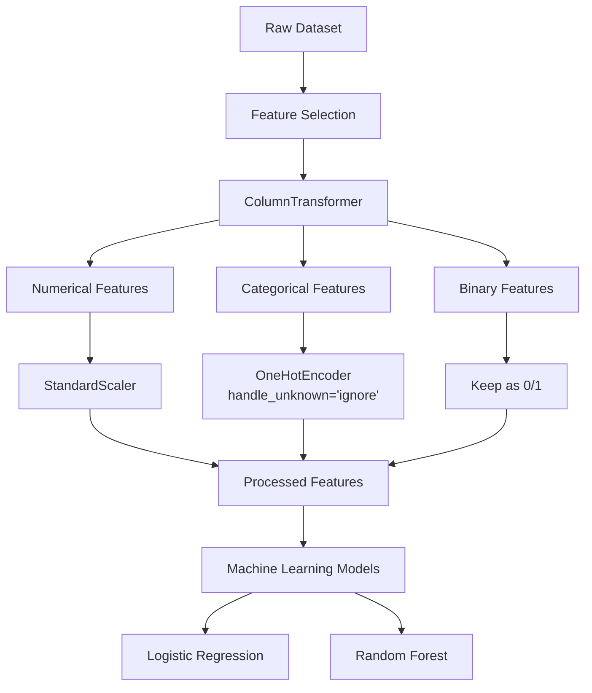
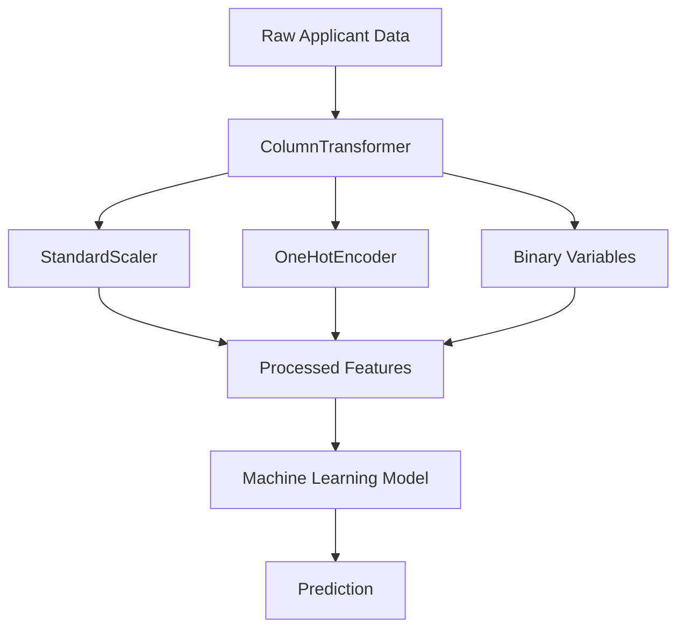
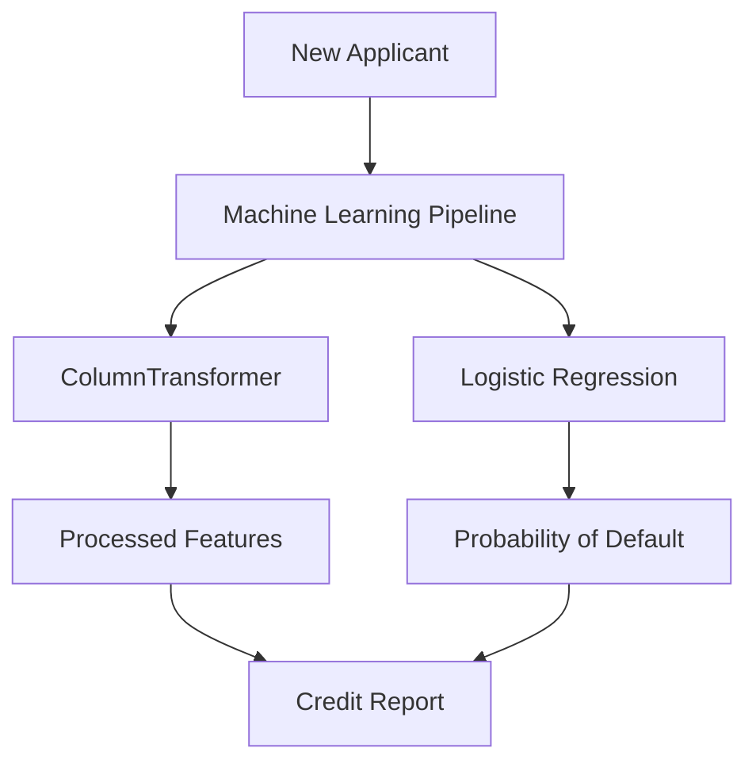
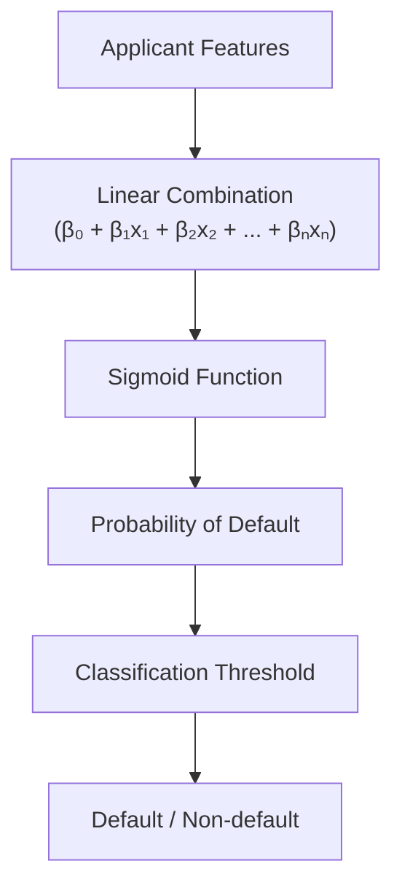
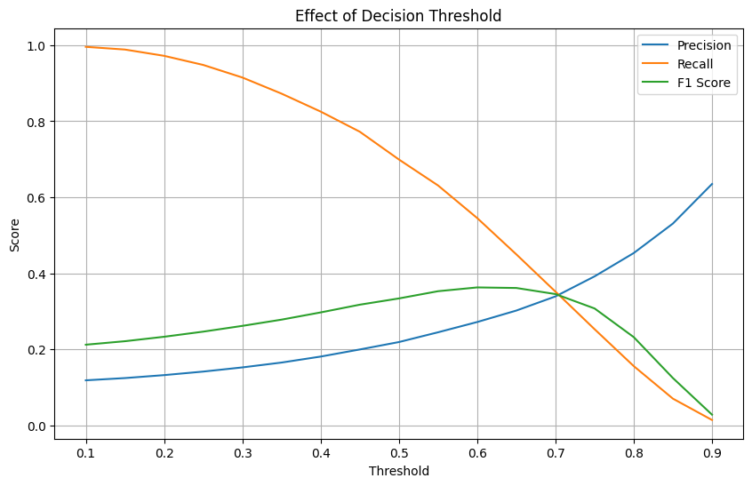
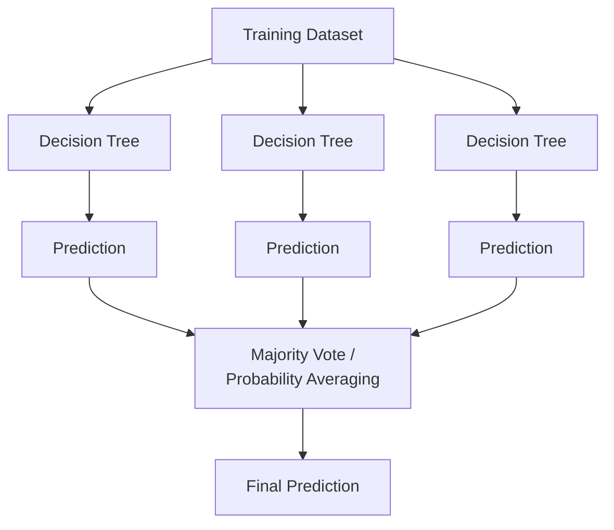
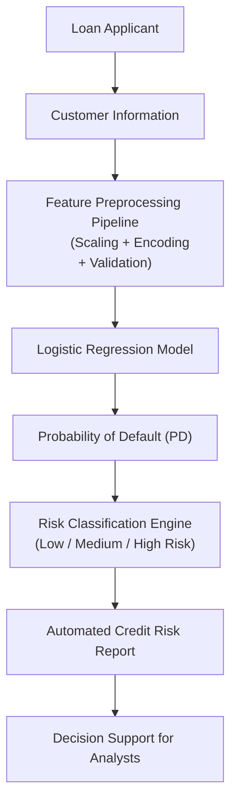
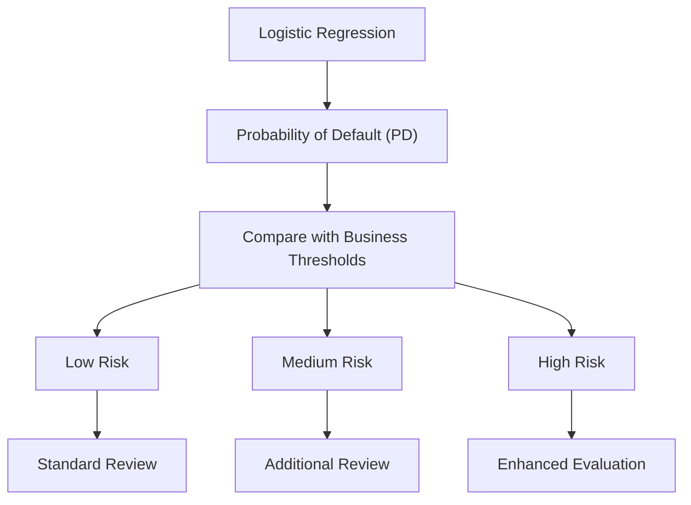
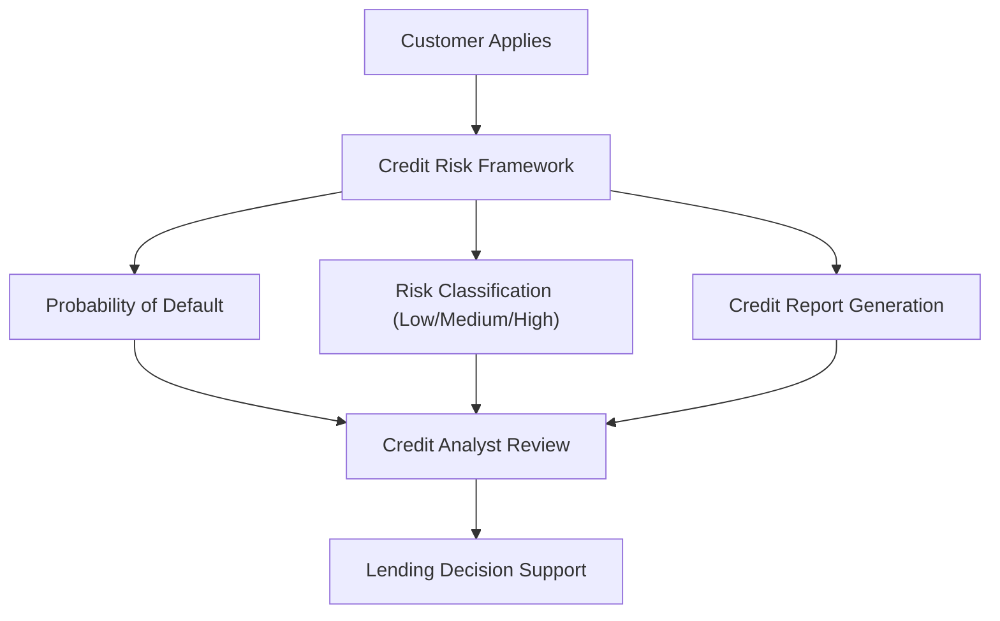
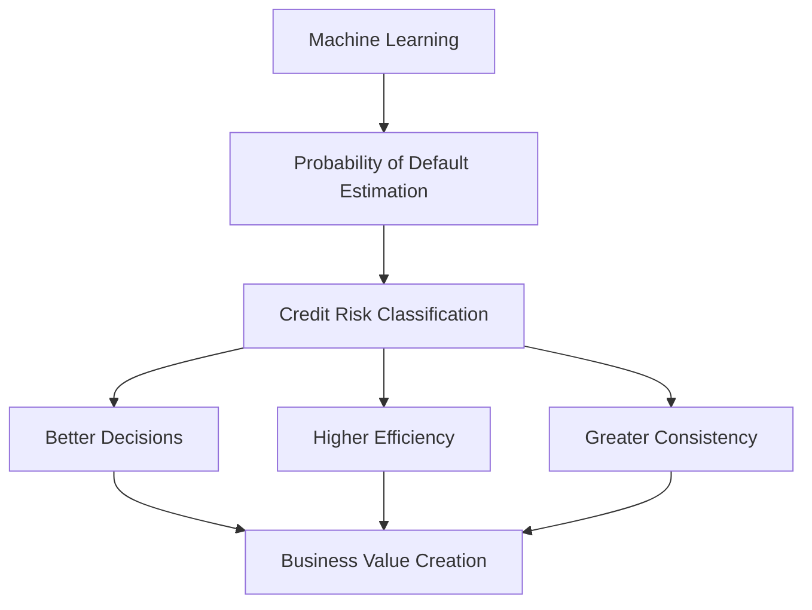

# Credit Risk Prediction Framework

## Project Documentation

# Table of Contents

- [1. Project Overview](#chapter-1--project-overview)
  - [1.1 Project Information](#11-project-information)
  - [1.2 Business Context](#12-business-context)
  - [1.3 Business Problem](#13-business-problem)
  - [1.4 Project Objective](#14-project-objective)
  - [1.5 Dataset Overview](#15-dataset-overview)
  - [1.6 Project Scope](#16-project-scope)
  - [1.7 Final Deliverables](#17-final-deliverables)

- [2. Business Understanding](#2-business-understanding)
  - [2.1 Business Context](#21-business-context)
  - [2.2 Business Problem](#22-business-problem)
  - [2.3 Why Machine Learning?](#23-why-machine-learning)
  - [2.4 Business Objectives](#24-business-objectives)
  - [2.5 Business Constraints](#25-business-constraints)
  - [2.6 Success Criteria](#26-success-criteria)
  - [2.7 Expected Deliverables](#27-expected-deliverables)

- [3. Dataset Description](#3-dataset-description)
  - [3.1 Dataset Overview](#31-dataset-overview)
  - [3.2 Dataset Dimensions](#32-dataset-dimensions)
  - [3.3 Target Variable](#33-target-variable)
  - [3.4 Feature Description](#34-feature-description)
  - [3.5 Variable Categories](#35-variable-categories)
  - [3.6 Target Distribution](#36-target-distribution)
  - [3.7 Initial Assumptions](#37-initial-assumptions)
  - [3.8 Dataset Limitations](#38-dataset-limitations)

- [4. Exploratory Data Analysis (EDA)](#4-exploratory-data-analysis-eda)
  - [4.1 Purpose of the EDA](#41-purpose-of-the-exploratory-data-analysis)
  - [4.2 Data Quality Assessment](#42-data-quality-assessment)
  - [4.3 Target Variable Analysis](#43-target-variable-analysis)
  - [4.4 Exploratory Analysis Strategy](#44-exploratory-analysis-strategy)
  - [4.5 Analytical Methodology](#45-analytical-methodology)
  - [4.6 Business-Driven Exploration](#46-business-driven-exploration)
  - [4.7 Demographic Profile Analysis](#47-demographic-profile-analysis)
  - [4.7.1 Variable Age](#471-age)
  - [4.8 Financial Capacity Analysis](#48-financial-capacity-analysis)
  - [4.8.1 Variable Income](#481-income)
  - [4.8.2 Variable Loan Amount](#482-loanamount)
  - [4.8.3 Variable Credit Score](#483-creditscore)
  - [4.8.4 Variable Months Employed](#484-monthsemployed)
  - [4.8.5 Variable Interest Rate](#485-interestrate)
  - [4.8.6 Variable DTIRatio](#486-debt-to-income-ratio-dtiratio)
  - [4.9 Categorical Variables Analysis](#49-categorical-variables-analysis)
  - [4.9.1 Variable Education](#491-education)
  - [4.9.2 Variable Employment Type](#492-employment-type)
  - [4.9.3 Variable Marital Status](#493-marital-status)
  - [4.9.4 Variable Loan Purpose](#494-loan-purpose)
  - [4.9.5 Binary Variables](#495-binary-variables)
  - [4.10 Overall Findings from the EDA](#410-overall-findings-from-the-exploratory-data-analysis)

- [5. Data Preparation](#chapter-5-data-preparation)
  - [5.1 Overview](#51-overview)
  - [5.2 Feature Selection](#52-feature-selection)
  - [5.3 Feature Categorization](#53-feature-categorization)
  - [5.4 Data Cleaning](#54-data-cleaning)
  - [5.5 Feature Transformation](#55-feature-transformation-using-columntransformer)
  - [5.6 Building the Machine Learning Pipeline](#56-building-the-machine-learning-pipeline)
  - [5.7 Train-Test Split](#57-train-test-split)

- [6. Model Development](#chapter-6-model-development)
  - [6.1 Overview](#61-overview)
  - [6.2 Baseline Model](#62-baseline-model)
  - [6.3 Logistic Regression](#63-logistic-regression)
  - [6.4 Threshold Analysis](#64-threshold-analysis)
  - [6.5 ROC Curve Analysis](#65-receiver-operating-characteristic-roc-curve)
  - [6.6 Precision-Recall Curve and Average Precision](#66-precision-recall-curve-and-average-precision)
  - [6.7 Model Interpretability](#67-model-interpretability)
  - [6.8 Random Forest](#68-random-forest)
  - [6.9 Model Comparison](#69-model-comparison)
  - [6.9.1 Performance Comparison](#691-performance-comparison)
  - [6.9.2 Interpretability Comparison](#692-interpretability-comparison)
  - [6.9.3 Business Comparison](#693-business-comparison)
  - [6.9.4 Final Model Selection](#694-final-model-selection)

- [7. Credit Risk Prediction Framework](#chapter-7-credit-risk-prediction-framework)
  - [7.1 Framework Overview](#71-framework-overview)
  - [7.2 Prediction Workflow](#72-prediction-workflow)
  - [7.3 Credit Risk Report Generator](#73-credit-risk-report-generator)
  - [7.4 Customer Risk Classification](#74-customer-risk-classification)
  - [7.5 Example Prediction](#75-example-prediction)
  - [7.6 Business Applications](#76-business-applications)
  - [7.7 Limitations](#77-limitations)
  - [7.8 Future Improvements](#78-future-improvements)

- [8. Conclusions](#chapter-8-conclusions)
  - [8.1 Project Summary](#81-project-summary)
  - [8.2 Key Findings](#82-key-findings)
  - [8.3 Business Impact](#83-business-impact)
  - [8.4 Technical Contributions](#84-technical-contributions)
  - [8.5 Final Remarks](#85-final-remarks)
---

# Chapter 1 — Project Overview

## 1.1 Project Information

**Project Name**

Credit Risk Prediction Framework

**Project Type**

End-to-End Machine Learning Project

**Domain**

Financial Services

**Business Area**

Credit Risk Analytics

**Machine Learning Task**

Binary Classification

---

## 1.2 Business Context

Financial institutions evaluate thousands of loan applications every day.

Approving a high-risk applicant may result in financial losses due to loan default, while rejecting a reliable customer represents a missed business opportunity.

Traditional credit evaluation relies on expert analysts and predefined business rules. Although effective, these approaches can be complemented by Machine Learning models capable of identifying hidden patterns associated with credit default.

The objective of this project is not to replace credit analysts, but to provide a decision-support tool capable of estimating the probability that a loan applicant will default.

---

## 1.3 Business Problem

Given historical information about previous loan applicants, predict whether a new applicant is likely to default on a loan.

The prediction should help financial institutions:

* Reduce financial losses.
* Improve credit approval decisions.
* Support risk analysts with data-driven insights.
* Standardize applicant evaluation.

---

## 1.4 Project Objective

Develop a complete Credit Risk Prediction Framework capable of:

* Exploring and understanding the dataset.
* Preparing the data for Machine Learning.
* Comparing multiple classification algorithms.
* Selecting the most appropriate model according to business objectives.
* Optimizing the decision threshold.
* Explaining model behavior.
* Predicting the probability of default for new applicants.
* Generating an automatic credit risk assessment report.

---

## 1.5 Dataset Overview

Dataset Name:

Loan Default Prediction Dataset

Target Variable:

Default

Target Classes:

* 0 → Non-default
* 1 → Default

Observations:

255,347 loan applications.

Features:

18 original variables including demographic, financial and loan-related information.

---

## 1.6 Project Scope

The project covers the complete Machine Learning lifecycle:

* Business understanding
* Exploratory Data Analysis
* Data preparation
* Feature preprocessing
* Model training
* Model evaluation
* Threshold optimization
* Model explainability
* Inference pipeline
* Business report generation

Future work includes business dashboard development using Power BI.

---

## 1.7 Final Deliverables

The final solution consists of:

* Complete Machine Learning pipeline.
* Trained Logistic Regression model.
* Automated preprocessing pipeline.
* Threshold optimization analysis.
* Explainability analysis.
* Credit Risk Assessment Report generator.
* Professional GitHub repository.
* Technical documentation.
* Future Power BI dashboard.

<a href="#table-of-contents">Back to Table of Contents</a>

# 2. Business Understanding

## 2.1 Business Context

Credit risk assessment is one of the most critical processes within financial institutions.

Every day, banks and lending organizations receive thousands of loan applications from customers with different financial profiles, employment conditions, credit histories, and borrowing needs.

For every application, the institution must answer a fundamental business question:

> **Should this loan be approved?**

Approving a loan to a customer who later defaults may generate significant financial losses, while rejecting a reliable customer represents a missed business opportunity.

Because of this trade-off, credit approval cannot rely exclusively on intuition or isolated variables. Instead, modern financial institutions combine expert judgment with statistical and Machine Learning models capable of identifying complex patterns associated with credit risk.

The purpose of this project is to develop a predictive framework that assists credit analysts by estimating the probability that an applicant will default on a loan.

The framework is intended to complement—not replace—human decision-making.

---

## 2.2 Business Problem

The institution possesses historical information from previous loan applicants.

Each record contains demographic, financial, employment, educational and loan-related information, together with the final loan outcome.

The business challenge is to leverage this historical data to estimate the risk associated with future applicants.

From a Machine Learning perspective, the objective can be summarized as follows:

> Predict whether a loan applicant will default based on historical applicant characteristics.

However, from a business perspective, the challenge is broader.

The institution seeks to improve the quality and consistency of credit approval decisions while reducing financial exposure to high-risk customers.

---

## 2.3 Why Machine Learning?

Traditional credit evaluation often relies on predefined business rules.

Examples include:

- Minimum credit score.
- Maximum debt-to-income ratio.
- Employment stability.
- Income verification.

Although these rules are useful, they may fail to capture nonlinear relationships between variables or interactions among multiple applicant characteristics.

Machine Learning provides the opportunity to learn these relationships directly from historical data and generate individualized risk estimates for each applicant.

Instead of replacing business rules, Machine Learning acts as an additional analytical layer that supports more informed decision-making.

---

## 2.4 Business Objectives

The primary business objectives of this project are:

- Identify applicants with elevated default risk.
- Support analysts during the credit approval process.
- Reduce expected financial losses.
- Improve consistency in credit decisions.
- Provide interpretable predictions.
- Build a reproducible and scalable analytical workflow.

These objectives guided every technical decision made throughout the project.

---

## 2.5 Business Constraints

Real-world credit risk models operate under several important constraints.

### Interpretability

Financial institutions require models whose predictions can be explained.

Analysts and regulators need to understand why a customer has been classified as high or low risk.

For this reason, model explainability was considered an essential component of the project.

---

### Class Imbalance

Most customers do not default.

Consequently, the dataset is naturally imbalanced, meaning that default cases represent only a minority of observations.

This characteristic makes traditional evaluation metrics such as Accuracy potentially misleading and requires additional evaluation strategies.

---

### Cost of Prediction Errors

Not all prediction errors have the same business impact.

Two types of errors may occur:

**False Positive**

A reliable customer is classified as high risk.

Business consequence:

- Lost business opportunity.
- Potential customer dissatisfaction.

---

**False Negative**

A risky customer is classified as low risk.

Business consequence:

- Loan approval to a customer likely to default.
- Potential financial loss.

Because the financial impact of false negatives is typically much higher than that of false positives, the evaluation process must prioritize the ability to identify risky applicants.

This consideration strongly influenced the model selection process.

---

## 2.6 Success Criteria

From a technical perspective, success is measured using multiple evaluation metrics rather than Accuracy alone.

The project evaluates:

- Precision
- Recall
- F1 Score
- ROC-AUC
- Precision-Recall Curve
- Average Precision

From a business perspective, success is defined by the model's ability to detect risky applicants while maintaining an acceptable number of false alarms.

Therefore, model selection is based on business usefulness rather than purely maximizing a single numerical metric.

---

## 2.7 Expected Deliverables

The expected deliverables of the project include:

- Exploratory Data Analysis.
- Data preprocessing pipeline.
- Trained Machine Learning model.
- Model comparison.
- Threshold optimization analysis.
- Explainability analysis.
- Automated inference pipeline.
- Credit risk assessment report.
- Power BI dashboard (future implementation).
- Professional GitHub repository.

<a href="#table-of-contents">Back to Table of Contents</a>

# 3. Dataset Description

## 3.1 Dataset Overview

This project uses the **Loan Default Prediction Dataset**, which contains historical information about loan applicants and the final outcome of each loan application.

The dataset represents a typical supervised learning classification problem where historical observations are used to predict the probability of default for future applicants.

Each observation corresponds to a single loan application.

The dataset contains both numerical and categorical variables describing the applicant's financial situation, employment status, education level, credit profile, and loan characteristics.

---

## 3.2 Dataset Dimensions

| Property | Value |
|----------|------:|
| Number of observations | 255,347 |
| Number of features | 18 |
| Target variable | Default |
| Machine Learning task | Binary Classification |

---

## 3.3 Target Variable

The response variable is **Default**, which indicates whether the applicant eventually defaulted on the loan.

| Value | Meaning |
|------:|---------|
| 0 | Non-default |
| 1 | Default |

The objective of the project is to estimate the probability that a future applicant belongs to class **1 (Default)**.

---

## 3.4 Feature Description

The dataset contains the following variables.

| Feature | Type | Description |
|---------|------|----------------------|
| Age | Numerical | Applicant age. |
| Income | Numerical | Annual income of the applicant. |
| LoanAmount | Numerical | Requested loan amount. |
| CreditScore | Numerical | Applicant credit score. |
| MonthsEmployed | Numerical | Employment duration in months. |
| NumCreditLines | Numerical | Number of active credit lines. |
| InterestRate | Numerical | Interest rate assigned to the loan. |
| LoanTerm | Numerical | Loan duration in months. |
| DTIRatio | Numerical | Debt-to-Income ratio. |
| Education | Categorical | Highest education level. |
| EmploymentType | Categorical | Employment status. |
| MaritalStatus | Categorical | Marital status. |
| HasMortgage | Binary | Indicates whether the applicant owns a mortgage. |
| HasDependents | Binary | Indicates whether the applicant has financial dependents. |
| LoanPurpose | Categorical | Purpose of the requested loan. |
| HasCoSigner | Binary | Indicates whether the applicant has a co-signer. |
| LoanID | Identifier | Unique loan identifier (removed before modeling). |
| Default | Target | Loan default indicator. |

---

## 3.5 Variable Categories

To facilitate both exploratory analysis and business interpretation, variables were conceptually grouped into business domains.

### Financial Capacity

Variables that describe the applicant's ability to repay the loan.

- Income
- LoanAmount
- InterestRate
- DTIRatio

---

### Credit History

Variables associated with previous financial behavior.

- CreditScore
- NumCreditLines

---

### Employment Stability

Variables representing employment conditions.

- MonthsEmployed
- EmploymentType

---

### Demographic Profile

Applicant characteristics.

- Age
- Education
- MaritalStatus
- HasDependents

---

### Loan Characteristics

Information describing the requested loan.

- LoanPurpose
- LoanTerm
- HasMortgage
- HasCoSigner

---

## 3.6 Target Distribution

One of the first observations made during exploratory analysis was that the dataset is **highly imbalanced**.

Approximately:

| Class | Description | Count |
|------:|-------------|------:|
| 0 | Non-default | 225,694 |
| 1 | Default | 29,653 |

Only around **11.6%** of the observations correspond to loan defaults.

This imbalance has important implications for model training and evaluation.

Traditional metrics such as Accuracy may produce misleading conclusions because a model can achieve high Accuracy simply by predicting the majority class.

For this reason, additional metrics such as Precision, Recall, F1 Score, ROC-AUC and Precision-Recall analysis were incorporated into the evaluation process.

---

## 3.7 Initial Assumptions

Before performing exploratory analysis, several hypotheses were formulated regarding the relationship between applicant characteristics and default probability.

Examples include:

- Younger applicants may exhibit higher default rates.
- Higher income is expected to reduce default risk.
- Larger loan amounts may increase repayment difficulty.
- Longer employment history may indicate greater financial stability.
- Higher interest rates may be associated with increased default probability.
- Lower credit scores may correlate with higher credit risk.
- Debt-to-Income ratio may be positively associated with default.

These hypotheses were later evaluated during the Exploratory Data Analysis stage.

---

## 3.8 Dataset Limitations

Although the dataset provides sufficient information for predictive modeling, several limitations should be acknowledged.

Examples include:

- No temporal information regarding macroeconomic conditions.
- No previous payment history.
- No detailed credit bureau records.
- No geographic information.
- No customer behavioral variables.

Therefore, the model should be interpreted as a decision-support system rather than a complete credit approval solution.

---

## Key Takeaways

- The project is based on a real-world binary classification problem.
- The dataset contains demographic, financial, employment and loan-related information.
- The target variable is naturally imbalanced.
- Variables were organized into business domains to improve interpretability.
- Initial hypotheses guided the Exploratory Data Analysis.
- Understanding the dataset structure was essential before model development.

<a href="#table-of-contents">Back to Table of Contents</a>

# 4. Exploratory Data Analysis (EDA)

## 4.1 Purpose of the Exploratory Data Analysis

Before developing predictive models, it was necessary to thoroughly understand the dataset.

The objective of the Exploratory Data Analysis (EDA) was not only to describe the available information, but also to identify patterns, detect anomalies, validate assumptions, and generate business insights that would later guide feature engineering and model development.

The EDA was designed to answer questions such as:

- What characteristics distinguish defaulting customers?
- Which variables appear to be associated with default?
- Are there missing values or inconsistencies?
- Does the dataset suffer from class imbalance?
- Which variables may require transformation before modeling?
- Which variables are likely to contribute the most predictive information?

Rather than treating the EDA as a mandatory preprocessing step, it was considered the foundation for every subsequent decision in the project.

---

## 4.2 Data Quality Assessment

The first stage of the analysis focused on evaluating the overall quality of the dataset.

The following aspects were reviewed:

- Dataset dimensions.
- Variable data types.
- Missing values.
- Duplicate observations.
- Summary statistics.
- Variable distributions.

The dataset presented a high level of quality.

No significant missing values were identified, allowing the analysis to proceed without requiring imputation strategies.

Similarly, no major inconsistencies were detected in variable types, making preprocessing considerably simpler.

This reduced the need for extensive data cleaning and allowed greater emphasis on business analysis and predictive modeling.

---

## 4.3 Target Variable Analysis

The first analytical step focused on understanding the response variable.

The target variable, **Default**, represents whether an applicant eventually defaulted on the loan.

Distribution analysis revealed a strong class imbalance.

Approximately 88% of applicants successfully repaid their loans, while only about 12% defaulted.

This observation immediately influenced the modeling strategy.

A highly imbalanced dataset implies that a model may achieve high Accuracy simply by predicting the majority class.

Consequently, Accuracy alone could not be considered an appropriate evaluation metric.

Instead, additional metrics such as Recall, Precision, F1 Score, ROC-AUC, Precision-Recall Curve, and Average Precision were incorporated throughout model evaluation.

The identification of class imbalance became one of the most important findings of the Exploratory Data Analysis.

---

## 4.4 Exploratory Analysis Strategy

Rather than analyzing variables in isolation, the exploratory analysis followed a structured business-oriented approach.

Variables were grouped according to their role within the credit evaluation process.

The analysis was organized into five business domains:

- Financial Capacity
- Credit History
- Employment Stability
- Demographic Profile
- Loan Characteristics

This organization facilitated interpretation from a banking perspective and later simplified the explanation of model behavior.

Instead of interpreting eighteen independent variables, the analysis focused on understanding how different dimensions of an applicant's profile influence credit risk.

---

## 4.5 Analytical Methodology

Each variable followed the same analytical workflow.

The following aspects were evaluated:

- Descriptive statistics.
- Distribution.
- Outlier detection.
- Default rate by category or interval.
- Relationship with the target variable.
- Business interpretation.

Whenever numerical variables were analyzed, quantile-based intervals were created to facilitate comparison of default rates across different applicant groups.

Categorical variables were evaluated by comparing the default rate associated with each category.

This methodology allowed technical findings to be translated into business insights rather than remaining purely statistical observations.

---

## 4.6 Business-Driven Exploration

Throughout the exploratory analysis, emphasis was placed on understanding the practical implications of each variable.

Instead of asking:

> "Is this variable statistically significant?"

the guiding question became:

> "How could this variable influence the probability that an applicant defaults?"

This perspective ensured that every statistical observation could later support business decision-making.

As a result, the EDA became much more than a descriptive exercise—it became the foundation for feature selection, model interpretation, and business recommendations.

---

## Key Takeaways

- The EDA served as the foundation of the entire Machine Learning workflow.
- The dataset presented good overall data quality.
- A strong class imbalance was identified early in the analysis.
- Variables were organized into meaningful business domains.
- Every variable was analyzed from both statistical and business perspectives.
- The exploratory analysis directly influenced preprocessing, model selection, and explainability.

# 4.7 Demographic Profile Analysis

The first business domain analyzed corresponds to the demographic characteristics of loan applicants.

Although demographic variables alone should never determine a credit decision, they often provide valuable information when combined with financial and behavioral variables.

The demographic analysis focused on understanding whether applicant characteristics such as age, education level, marital status, and family responsibilities were associated with different default behaviors.

The objective was not to establish causal relationships but rather to identify statistically observable risk patterns that could later contribute to predictive modeling.

---

# 4.7.1 Age

## Business Intuition

Age is frequently considered an indirect indicator of financial stability.

Older applicants generally have longer employment histories, more established financial habits, higher accumulated assets, and greater credit experience.

Conversely, younger applicants may still be building their careers, have lower income stability, shorter credit histories, and greater exposure to financial uncertainty.

For these reasons, age was expected to exhibit an inverse relationship with default probability.

---

## Initial Hypothesis

Before analyzing the data, the following hypothesis was proposed:

> Younger applicants would present higher default rates than older applicants.

This hypothesis was based on the assumption that financial stability tends to increase throughout an individual's professional life.

---

## Statistical Findings

The exploratory analysis confirmed a clear relationship between age and loan default.

Average applicant age:

| Default Status | Mean Age |
|---------------|----------:|
| Non-default | 44.41 years |
| Default | 36.56 years |

Applicants who defaulted were, on average, almost eight years younger than applicants who successfully repaid their loans.

To better understand this relationship, applicants were grouped into age intervals.

The default rate consistently decreased as age increased.

The youngest applicants exhibited the highest probability of default, while the oldest age groups presented the lowest observed default rates.

This monotonic trend suggested a strong inverse relationship between age and credit risk.

---

## Correlation Analysis

The Pearson correlation between Age and Default was approximately:

- **−0.168**

Although the magnitude of the correlation is moderate, the negative direction indicates that increasing age is associated with a lower probability of default.

Considering the complexity of financial behavior, this represents a meaningful relationship.

---

## Business Interpretation

Age should not be interpreted as the direct cause of default.

Instead, it likely acts as a proxy variable representing several latent characteristics, including:

- Professional stability.
- Financial maturity.
- Credit experience.
- Income progression.
- Long-term financial planning.

Consequently, younger applicants tend to accumulate multiple risk factors simultaneously, increasing their probability of default.

---

## Impact on Machine Learning

The relationship observed during exploratory analysis was later confirmed by the Logistic Regression model.

Age received the largest negative coefficient among all numerical variables.

This indicates that, holding all other variables constant, increasing applicant age decreases the estimated probability of default.

The consistency between exploratory analysis and model interpretation increased confidence in both the dataset and the selected model.

---

## Conclusion

Age emerged as one of the strongest predictors of default risk.

Although demographic variables should never be interpreted in isolation, the observed pattern was consistent throughout exploratory analysis, statistical evaluation, and model explainability.

This variable became one of the most influential features within the final Credit Risk Prediction Framework.

# 4.8 Financial Capacity Analysis

The second business domain analyzed corresponds to the applicant's financial capacity.

Financial capacity represents the applicant's ability to meet future loan obligations and is one of the most important dimensions considered during credit evaluation.

Unlike demographic variables, which often act as indirect indicators of financial behavior, financial variables directly describe the applicant's economic situation at the time of the loan application.

The variables included in this domain were:

- Income
- LoanAmount
- InterestRate
- Debt-to-Income Ratio (DTIRatio)

These variables were expected to have a substantial influence on the probability of default and later became some of the most important predictors within the final Machine Learning model.

---

# 4.8.1 Income

## Business Intuition

Income is one of the fundamental variables used in credit evaluation.

From a business perspective, applicants with higher income generally possess greater repayment capacity, allowing them to absorb unexpected financial events without immediately falling into default.

Conversely, applicants with lower income often have tighter financial margins, making them more vulnerable to unemployment, emergencies, inflation, or increases in debt obligations.

Therefore, income was expected to exhibit a negative relationship with default probability.

---

## Initial Hypothesis

Before analyzing the data, the following hypothesis was proposed:

> Applicants with lower income would present higher default rates than applicants with higher income.

This expectation was based on the assumption that repayment capacity increases with available income.

---

## Statistical Findings

The exploratory analysis supported the initial hypothesis.

Average annual income:

| Default Status | Mean Income |
|---------------|------------:|
| Non-default | 83,899.17 |
| Default | 71,844.72 |

Applicants who defaulted earned substantially less, on average, than applicants who successfully repaid their loans.

To facilitate interpretation, income was divided into quantile-based intervals.

The analysis revealed a clear risk gradient.

Applicants within the lowest income group exhibited the highest observed default rate, while default probability gradually decreased as income increased.

The lowest income segment presented a default rate close to 18.5%, representing the highest risk group identified during this analysis.

---

## Observed Patterns

Although income displayed a clear inverse relationship with default probability, the analysis also revealed that income alone was not sufficient to explain credit risk.

Some applicants with relatively high income still defaulted.

This suggested that income should always be interpreted alongside additional variables such as:

- Loan amount.
- Interest rate.
- Employment stability.
- Debt-to-Income ratio.
- Credit history.

This observation reinforced the importance of multivariable modeling rather than relying on individual business rules.

---

## Business Interpretation

Income directly reflects an applicant's repayment capacity.

However, repayment capacity depends not only on absolute income but also on the relationship between income and financial obligations.

For example:

An applicant earning a high salary may still represent elevated credit risk if requesting a disproportionately large loan or carrying significant existing debt.

Consequently, income should be interpreted as one component within a broader financial profile.

---

## Impact on Machine Learning

The importance of income remained evident throughout the project.

During the explainability stage, Logistic Regression assigned Income one of the largest negative coefficients among all numerical variables.

This indicates that increasing applicant income decreases the estimated probability of default while holding all remaining variables constant.

The agreement between exploratory analysis and model interpretation provided additional confidence in the predictive framework.

---

## Conclusion

Income proved to be one of the strongest indicators of financial capacity.

Applicants with lower income consistently exhibited higher default rates, confirming the initial business hypothesis.

Although income alone cannot fully explain repayment behavior, it became one of the most influential variables within the final Credit Risk Prediction Framework and played a key role in the estimation of applicant risk.

# 4.8.2 LoanAmount

## Business Intuition

The requested loan amount represents the financial exposure assumed by the lending institution.

From a business perspective, larger loans generally imply greater repayment obligations, increasing the financial burden placed on the borrower.

Assuming all other applicant characteristics remain constant, requesting a larger loan is expected to increase the probability of financial stress and, consequently, the likelihood of default.

However, the loan amount should never be evaluated in isolation.

A high loan amount requested by a high-income applicant may represent considerably less risk than the same amount requested by an applicant with limited repayment capacity.

Therefore, LoanAmount must always be interpreted together with variables describing financial capacity.

---

## Initial Hypothesis

Before analyzing the data, the following hypothesis was proposed:

> Applicants requesting larger loan amounts would present higher default rates than those requesting smaller loans.

This expectation was based on the assumption that larger financial obligations increase repayment difficulty.

---

## Statistical Findings

The exploratory analysis supported the initial hypothesis.

Average loan amount:

| Default Status | Mean Loan Amount |
|---------------|-----------------:|
| Non-default | 125,353.66 |
| Default | 144,515.31 |

Applicants who defaulted requested, on average, significantly larger loans than applicants who successfully repaid them.

To further investigate this relationship, loan amounts were divided into quantile-based intervals.

The analysis revealed a progressive increase in default rates as the requested loan amount increased.

The highest loan amount group exhibited the highest observed default rate, reaching approximately 15.8%.

This pattern suggested a positive relationship between loan amount and credit risk.

---

## Observed Patterns

Although the general trend indicated increasing risk for larger loans, the analysis also revealed that loan amount alone cannot determine creditworthiness.

Several high-value loans were successfully repaid.

This observation reinforced an important business principle:

Loan size must always be evaluated relative to the applicant's financial capacity.

In particular, the interaction between:

- Income
- LoanAmount
- InterestRate
- Debt-to-Income Ratio

provides a much more realistic representation of repayment ability than any individual variable.

---

## Business Interpretation

The requested loan amount reflects the level of financial commitment assumed by the applicant.

As loan obligations increase, borrowers become more vulnerable to unexpected financial events such as unemployment, medical emergencies, or economic downturns.

Consequently, larger loans naturally expose both the borrower and the financial institution to greater risk.

Nevertheless, responsible lending decisions require evaluating whether the requested amount is appropriate given the applicant's overall financial profile.

---

## Impact on Machine Learning

The importance of LoanAmount remained evident during model development.

Logistic Regression assigned LoanAmount one of the largest positive coefficients among all numerical variables.

This indicates that, holding all remaining variables constant, requesting a larger loan increases the estimated probability of default.

The consistency between exploratory analysis and model explainability confirmed that LoanAmount is a meaningful predictor of credit risk.

---

## Conclusion

LoanAmount proved to be one of the strongest financial predictors within the dataset.

Applicants requesting larger loans consistently exhibited higher default rates, confirming the original business hypothesis.

Although the requested amount should never be evaluated independently, it became a highly informative variable within the final Credit Risk Prediction Framework and played an important role in estimating applicant risk.

# 4.8.3 CreditScore

## Business Intuition

Credit Score is one of the most widely used indicators in credit risk assessment.

It summarizes an applicant's historical credit behavior into a single numerical value, allowing financial institutions to estimate the probability that a customer will fulfill future financial obligations.

Applicants with higher credit scores are generally expected to demonstrate stronger repayment behavior, while lower scores are commonly associated with greater credit risk.

For this reason, Credit Score was expected to become one of the strongest predictors of default within the project.

---

## Initial Hypothesis

Before analyzing the data, the following hypothesis was proposed:

> Applicants with lower credit scores would exhibit higher default rates than applicants with higher credit scores.

This expectation was based on standard credit risk practices used throughout the financial industry.

---

## Statistical Findings

The exploratory analysis confirmed the expected inverse relationship between Credit Score and default probability.

Average Credit Score:

| Default Status | Mean Credit Score |
|---------------|------------------:|
| Non-default | 576.23 |
| Default | 559.29 |

Applicants who defaulted consistently presented lower credit scores than those who successfully repaid their loans.

To facilitate interpretation, applicants were grouped into Credit Score intervals.

The analysis revealed a gradual reduction in default rates as Credit Score increased.

Applicants within the lowest score interval exhibited the highest observed default rates, while the highest score interval presented the lowest risk.

Although the differences between adjacent score groups were not extremely large, the overall trend remained consistent throughout the dataset.

---

## Observed Patterns

The analysis confirmed that Credit Score behaves as expected from a business perspective.

Higher scores were associated with lower probabilities of default.

However, the exploratory analysis also demonstrated that Credit Score alone cannot perfectly distinguish between reliable and risky applicants.

Some applicants with relatively high scores still defaulted, while others with moderate scores successfully repaid their loans.

This observation reinforces an important principle of predictive modeling:

Credit decisions should never rely on a single variable.

Instead, risk should be estimated using the combined information provided by multiple applicant characteristics.

---

## Business Interpretation

Credit Score reflects an applicant's historical credit behavior rather than their current financial situation.

Consequently, it should be interpreted together with variables describing present repayment capacity, including:

- Income
- Loan Amount
- Employment Stability
- Debt-to-Income Ratio
- Interest Rate

A strong credit history does not completely eliminate future credit risk if current financial conditions deteriorate.

Likewise, applicants with moderate credit scores may still represent acceptable risk when supported by stable employment and strong financial capacity.

---

## Impact on Machine Learning

The importance of Credit Score remained evident during model development.

Logistic Regression assigned Credit Score a negative coefficient, indicating that increasing credit score reduces the estimated probability of default.

Although Credit Score proved to be an important predictor, it was not the variable with the greatest influence within the final model.

Other variables—particularly Age and Interest Rate—received larger coefficients.

This finding highlights one of the advantages of Machine Learning models:

Rather than assuming which variable is most important, the model learns the relative contribution of each feature directly from historical data.

---

## Conclusion

Credit Score confirmed its value as a strong predictor of credit risk.

Applicants with lower scores consistently exhibited higher default rates, validating the initial business hypothesis.

However, the analysis also demonstrated that Credit Score should be interpreted as one component of a broader applicant profile rather than as an isolated decision criterion.

The final Machine Learning model successfully integrated Credit Score with additional financial, demographic, and employment-related variables to produce a more comprehensive estimate of applicant risk.

### Lessons Learned

Although Credit Score is traditionally considered one of the most important variables in credit risk assessment, this project demonstrated that predictive importance should be determined empirically rather than assumed.

Machine Learning models evaluate variables jointly, allowing other applicant characteristics to contribute more strongly to the final prediction when supported by historical data.

# 4.8.4 MonthsEmployed

## Business Intuition

Employment stability is one of the fundamental dimensions considered during credit evaluation.

Applicants with longer employment histories generally demonstrate greater financial stability, more predictable income streams, and a stronger ability to meet long-term financial obligations.

Conversely, recently employed applicants may still be experiencing financial instability or career transitions, making them more vulnerable to unexpected income interruptions.

For these reasons, employment duration was expected to present an inverse relationship with default probability.

---

## Initial Hypothesis

Before performing the analysis, the following hypothesis was proposed:

> Applicants with longer employment histories would exhibit lower default rates than recently employed applicants.

This expectation was based on the assumption that employment stability improves repayment capacity.

---

## Statistical Findings

The exploratory analysis strongly supported the initial hypothesis.

Average employment duration:

| Default Status | Mean Months Employed |
|---------------|---------------------:|
| Non-default | 60.76 months |
| Default | 50.24 months |

Applicants who defaulted had, on average, approximately ten fewer months of employment than applicants who successfully repaid their loans.

To better understand this relationship, employment duration was divided into quantile-based intervals.

The analysis revealed a remarkably consistent trend.

| Employment Duration | Default Rate |
|--------------------|-------------:|
| 0–24 months | 16.24% |
| 24–48 months | 13.52% |
| 48–72 months | 11.06% |
| 72–96 months | 9.30% |
| 96–119 months | 7.61% |

The probability of default decreased almost monotonically as employment duration increased.

This represented one of the clearest business patterns identified during the entire exploratory analysis.

---

## Correlation Analysis

The Pearson correlation between MonthsEmployed and Default was approximately:

- **−0.097**

Although moderate in magnitude, the negative correlation confirms that longer employment duration is associated with lower default probability.

Considering the multifactorial nature of credit risk, this relationship is meaningful from both statistical and business perspectives.

---

## Multivariable Analysis

An additional analysis combined Employment Duration with Employment Type.

The resulting heatmap revealed an even stronger business pattern.

Applicants who were:

- unemployed,
- and had less than two years of employment history,

presented the highest observed default rate within this business domain.

Conversely, applicants employed full-time with long employment histories exhibited the lowest observed default rates.

This analysis demonstrated that employment duration should not be interpreted independently but rather in combination with employment status.

The interaction between both variables provides a significantly richer representation of applicant stability.

---

## Business Interpretation

Employment duration serves as an indirect indicator of several important characteristics, including:

- Income stability.
- Professional experience.
- Career continuity.
- Financial planning capacity.

Long employment histories generally reduce uncertainty regarding future repayment ability.

However, employment duration alone cannot fully determine applicant risk.

Stable employment combined with healthy financial indicators provides considerably more predictive information than either variable independently.

---

## Impact on Machine Learning

The relevance of MonthsEmployed remained evident throughout model development.

Logistic Regression assigned MonthsEmployed one of the largest negative coefficients among all numerical variables.

This indicates that increasing employment duration reduces the estimated probability of default while holding all remaining variables constant.

The consistency between exploratory analysis and model explainability reinforces confidence in both the dataset and the final predictive model.

---

## Conclusion

MonthsEmployed emerged as one of the strongest indicators of applicant stability.

The variable exhibited a clear inverse relationship with default probability throughout the exploratory analysis.

Its predictive importance remained consistent during model training, making it one of the key variables within the final Credit Risk Prediction Framework.

---

### Lessons Learned

Employment stability is not solely determined by employment status.

The duration of employment provides additional information regarding financial consistency and repayment capacity.

Combining employment duration with employment type generated substantially more business insight than analyzing either variable independently.

This reinforces one of the central principles of Machine Learning:

The interaction between variables often provides more predictive value than individual variables considered in isolation.

# 4.8.5 InterestRate

## Business Intuition

Interest Rate represents the financial cost associated with borrowing.

From a borrower’s perspective, higher interest rates increase the monthly payment required to service the loan, placing additional pressure on the applicant's financial capacity.

From the lender's perspective, however, interest rates are not assigned randomly.

Financial institutions typically charge higher interest rates to applicants perceived as presenting greater credit risk.

Consequently, Interest Rate reflects not only the cost of borrowing but also the institution's own assessment of applicant risk.

For this reason, Interest Rate was expected to exhibit a positive relationship with default probability.

---

## Initial Hypothesis

Before analyzing the data, the following hypothesis was proposed:

> Applicants receiving higher interest rates would exhibit higher default rates.

This expectation was based on two complementary ideas:

- Higher borrowing costs increase repayment difficulty.
- Financial institutions usually assign higher interest rates to riskier applicants.

---

## Statistical Findings

The exploratory analysis confirmed the expected relationship.

Applicants who defaulted generally received loans with higher interest rates than applicants who successfully repaid their loans.

Although Interest Rate alone cannot explain repayment behavior, the observed trend consistently showed increasing default rates as interest rates increased.

This relationship suggested that Interest Rate captures valuable information regarding both borrower affordability and institutional risk assessment.

---

## Observed Patterns

Unlike variables such as Income or Age, Interest Rate should not be interpreted as an independent applicant characteristic.

Instead, it represents the outcome of a prior credit evaluation performed by the financial institution.

Therefore, Interest Rate contains implicit information regarding the lender's perception of applicant risk.

This characteristic makes the variable particularly informative for predictive modeling.

However, it also requires careful interpretation.

Higher interest rates do not necessarily cause loan default.

Rather, they are associated with applicants who already present characteristics linked to elevated credit risk.

---

## Business Interpretation

Interest Rate captures two complementary dimensions.

First, it directly increases the applicant's repayment burden.

Higher monthly payments reduce available disposable income and increase financial stress.

Second, it indirectly reflects the institution's assessment of applicant risk.

Applicants receiving higher interest rates have often already been identified as relatively riskier borrowers during the credit approval process.

Therefore, Interest Rate acts as both:

- a financial burden indicator,
- and a proxy for perceived credit risk.

This dual interpretation explains why the variable demonstrated substantial predictive value throughout the project.

---

## Impact on Machine Learning

The explainability analysis revealed one of the most important findings of the entire project.

Among all numerical variables included in the Logistic Regression model, Interest Rate received the largest positive coefficient.

Coefficient:

**0.458580**

This indicates that increasing Interest Rate increases the estimated probability of default while holding all remaining variables constant.

Importantly, this coefficient should not be interpreted as evidence of causality.

Instead, it reflects a strong statistical association learned from historical loan data.

The consistency between exploratory analysis and model explainability reinforces confidence in the predictive framework.

---

## Conclusion

Interest Rate emerged as the strongest positive predictor within the final Logistic Regression model.

The variable captures valuable information regarding both repayment burden and institutional risk assessment.

Its importance demonstrates that variables generated during the lending process may contain predictive information beyond applicant demographic and financial characteristics.

---

### Lessons Learned

One of the most valuable lessons from this project was learning the distinction between **association** and **causality**.

Machine Learning models identify statistical relationships within historical data.

Although higher interest rates are strongly associated with increased default probability, the model does not imply that raising interest rates alone causes default.

Proper interpretation requires understanding the business process that generated the data.

In credit risk analytics, domain knowledge is essential for interpreting model coefficients responsibly.

# 4.8.6 Debt-to-Income Ratio (DTIRatio)

## Business Intuition

The Debt-to-Income Ratio (DTI) measures the proportion of an applicant's income that is committed to debt obligations.

From a financial perspective, this metric is commonly used to evaluate whether an applicant has sufficient disposable income to assume additional debt.

Applicants with higher DTI values are generally expected to face greater financial pressure, making them more susceptible to repayment difficulties.

For this reason, DTIRatio was initially expected to be one of the strongest predictors of loan default.

---

## Initial Hypothesis

Before analyzing the data, the following hypothesis was proposed:

> Applicants with higher Debt-to-Income Ratios would present significantly higher default rates.

This expectation was based on standard lending practices, where DTI is often considered one of the primary indicators of repayment capacity.

---

## Statistical Findings

Contrary to the initial hypothesis, the exploratory analysis revealed only a weak relationship between DTIRatio and default probability.

Average DTI:

| Default Status | Mean DTI |
|---------------|---------:|
| Non-default | 0.50 |
| Default | 0.51 |

Although applicants who defaulted presented slightly higher DTI values, the difference between both groups was minimal.

To further investigate this relationship, applicants were divided into DTI intervals.

The resulting default rates varied only modestly across the different groups, ranging approximately from **10.6% to 12.3%**.

Unlike variables such as Age, Income, or MonthsEmployed, no clear monotonic trend was observed.

---

## Correlation Analysis

The Pearson correlation between DTIRatio and Default was approximately:

**0.019**

This extremely small positive correlation indicates that DTIRatio has almost no linear relationship with default within this dataset.

Although statistically measurable, the association is too weak to consider DTIRatio an independent predictor of default.

---

## Observed Patterns

One of the most interesting findings of the exploratory analysis was that DTIRatio behaved differently from expectations.

Despite being widely recognized as an important financial indicator, the variable displayed very limited discriminatory power within this dataset.

Applicants with both low and high DTI values appeared across both target classes.

This suggests that repayment behavior cannot be adequately explained by debt burden alone.

Instead, default risk appears to emerge from the interaction of multiple applicant characteristics.

---

## Business Interpretation

Several factors may explain the weak relationship observed.

First, the dataset may already contain other variables that capture similar financial information, such as:

- Income
- Loan Amount
- Interest Rate

These variables may reduce the additional predictive contribution of DTIRatio.

Second, credit default is inherently multifactorial.

Even applicants with relatively high debt burdens may successfully repay their loans if they possess:

- Stable employment.
- Strong credit history.
- High income.
- Conservative borrowing behavior.

Conversely, applicants with relatively low DTI values may still default due to external financial shocks not represented in the dataset.

---

## Impact on Machine Learning

During model development, DTIRatio received a positive coefficient within the Logistic Regression model.

However, its magnitude was considerably smaller than those assigned to variables such as:

- Age
- Interest Rate
- Income
- MonthsEmployed
- LoanAmount

This finding remained consistent with the exploratory analysis.

Although DTIRatio contributes useful information to the model, it is not among the primary drivers of default prediction.

---

## Conclusion

The exploratory analysis did not support the initial expectation that DTIRatio would be one of the strongest predictors of credit risk.

Instead, the variable demonstrated only a weak relationship with default probability.

This finding illustrates an important principle of applied Machine Learning:

Variables that are theoretically important do not necessarily become the strongest predictors within every dataset.

Empirical analysis should always take precedence over assumptions.

---

### Lessons Learned

One of the most valuable lessons from this analysis was understanding that business intuition must always be validated using data.

Although Debt-to-Income Ratio is widely recognized as an important financial metric, its predictive value depends on the characteristics of the available dataset.

This reinforces one of the central principles of Data Science:

**Models should be driven by evidence rather than expectations.**

# 4.9 Categorical Variables Analysis

The next stage of the exploratory analysis focused on categorical variables.

Unlike numerical variables, categorical features describe qualitative characteristics of the applicants, such as education level, employment status, marital status, and loan purpose.

For each categorical variable, the analysis included:

- Category distribution.
- Default rate by category.
- Statistical association with the target variable.
- Business interpretation.
- Potential contribution to predictive modeling.

Whenever appropriate, statistical association was evaluated using the Chi-Square Test together with Cramer's V, allowing both statistical significance and practical association strength to be assessed.

---

# 4.9.1 Education

## Business Intuition

Education level is commonly associated with long-term socioeconomic characteristics.

Applicants with higher educational attainment may have greater employment opportunities, more stable careers, and higher expected lifetime income.

Consequently, education was expected to exhibit some relationship with loan repayment behavior.

However, because education is an indirect indicator of financial stability, it was not expected to become one of the strongest predictors of default.

---

## Initial Hypothesis

Before analyzing the data, the following hypothesis was proposed:

> Applicants with lower educational attainment would present higher default rates than applicants with advanced academic degrees.

This expectation was based on the assumption that higher education generally improves long-term earning potential.

---

## Category Distribution

The dataset presented an almost perfectly balanced distribution across education levels.

| Education Level | Approximate Distribution |
|-----------------|------------------------:|
| Bachelor's | 25.21% |
| High School | 25.03% |
| Master's | 24.88% |
| PhD | 24.88% |

The balanced distribution ensured that comparisons between categories were not biased by large differences in sample size.

---

## Default Rate Analysis

The default rate varied across education levels.

| Education Level | Default Rate |
|-----------------|-------------:|
| High School | 12.88% |
| Bachelor's | 12.10% |
| Master's | 10.87% |
| PhD | 10.59% |

Applicants with only a High School education exhibited the highest observed default rate.

Conversely, applicants holding PhD degrees presented the lowest default rate.

Although the differences were relatively small, the overall trend aligned with the original business intuition.

---

## Statistical Association

To evaluate whether Education was associated with Default, a Chi-Square test of independence was performed.

The test indicated statistical significance.

However, statistical significance alone does not measure practical importance.

Therefore, Cramer's V was calculated.

Cramer's V:

**0.029**

This value indicates a **very weak association** between Education and Default.

Although education exhibits some relationship with repayment behavior, its practical predictive contribution is limited.

---

## Business Interpretation

Education should not be interpreted as a direct determinant of default risk.

Instead, it likely acts as a proxy for other characteristics, including:

- Career opportunities.
- Expected income growth.
- Professional stability.
- Long-term socioeconomic conditions.

Many of these characteristics are already captured more directly by variables such as:

- Income
- Employment Duration
- Employment Type

Consequently, the independent contribution of Education becomes relatively small.

---

## Impact on Machine Learning

The Logistic Regression model assigned different coefficients to each education category.

Among them:

- High School received a positive coefficient, indicating increased estimated default probability.
- Master's and PhD received negative coefficients, indicating reduced estimated risk.

These coefficients remained consistent with the exploratory analysis.

However, their magnitudes were considerably smaller than those of major numerical predictors such as Age, Income, Interest Rate, and MonthsEmployed.

This confirms that Education contributes useful contextual information without becoming a primary driver of prediction.

---

## Conclusion

Education exhibited a statistically detectable but practically weak relationship with default probability.

Applicants with lower educational attainment presented slightly higher default rates, while postgraduate education was associated with lower observed risk.

Nevertheless, the overall predictive contribution of Education remained modest compared to financial and employment-related variables.

---

### Lessons Learned

One of the key lessons from this analysis is that **statistical significance does not necessarily imply strong predictive importance**.

Large datasets frequently produce statistically significant results even when the practical association between variables is weak.

For this reason, measures of association strength—such as Cramer's V—are essential complements to significance testing.

This analysis reinforced the importance of evaluating both statistical and business relevance before drawing conclusions.

# 4.9.2 Employment Type

## Business Intuition

Employment status is one of the most relevant indicators of an applicant's financial stability.

Unlike income, which measures current earning capacity, employment type reflects the stability and predictability of future income.

Applicants with stable full-time employment generally receive regular salaries, making future loan payments more predictable.

Conversely, unemployed applicants or those with less stable employment arrangements may experience greater income uncertainty, increasing the probability of repayment difficulties.

For this reason, Employment Type was expected to be one of the strongest categorical predictors of default.

---

## Initial Hypothesis

Before analyzing the data, the following hypothesis was proposed:

> Applicants with stable full-time employment would exhibit lower default rates, while unemployed applicants would represent the highest-risk group.

This expectation was based on the assumption that employment stability directly influences repayment capacity.

---

## Category Distribution

The dataset contains four employment categories:

- Full-time
- Part-time
- Self-employed
- Unemployed

Each category represents a distinct level of employment stability and income predictability.

---

## Default Rate Analysis

The exploratory analysis confirmed the initial hypothesis.

| Employment Type | Default Rate |
|-----------------|-------------:|
| Full-time | 9.46% |
| Self-employed | 11.46% |
| Part-time | 11.97% |
| Unemployed | 13.55% |

Applicants employed full-time exhibited the lowest observed default rate.

In contrast, unemployed applicants presented the highest default rate among all employment categories.

The difference between both groups exceeded four percentage points, representing one of the clearest patterns identified among the categorical variables.

---

## Multivariable Analysis

Employment Type became even more informative when analyzed together with MonthsEmployed.

A heatmap combining both variables revealed a clear gradient of credit risk.

The highest observed default rates corresponded to applicants who were:

- Unemployed.
- Had less than two years of employment history.

Conversely, applicants working full-time with long employment histories exhibited the lowest default rates within this business domain.

This finding demonstrated that employment stability cannot be fully captured using a single variable.

Instead, Employment Type and MonthsEmployed complement one another, providing a more comprehensive representation of an applicant's professional stability.

---

## Business Interpretation

Employment Type represents more than an applicant's current occupation.

It provides indirect information regarding:

- Income predictability.
- Employment continuity.
- Financial resilience.
- Career stability.

Applicants with stable employment are generally better positioned to absorb temporary financial shocks without interrupting loan payments.

By contrast, unemployment increases uncertainty regarding future income, naturally elevating credit risk.

---

## Impact on Machine Learning

The importance of Employment Type remained evident during model development.

Logistic Regression assigned distinct coefficients to each employment category.

Among them:

- **EmploymentType_Unemployed** received one of the largest positive coefficients, increasing the estimated probability of default.
- **EmploymentType_Full-time** received one of the strongest negative coefficients, reducing the estimated probability of default.

These coefficients closely matched the patterns observed during the exploratory analysis.

The agreement between EDA and model explainability reinforces confidence in the predictive framework.

---

## Conclusion

Employment Type emerged as one of the strongest categorical predictors of credit risk.

Applicants with stable full-time employment consistently exhibited lower default rates, while unemployment was associated with the highest observed levels of default.

The variable became even more informative when combined with MonthsEmployed, highlighting the importance of evaluating employment stability as a multidimensional concept rather than relying on a single indicator.

---

### Lessons Learned

One of the main lessons from this analysis is that employment stability extends beyond simply being employed or unemployed.

A comprehensive evaluation requires considering both:

- The type of employment.
- The duration of employment.

This reinforces an important principle of predictive analytics:

Multiple complementary variables often provide substantially more predictive information than any single feature considered independently.

The consistency between the exploratory analysis and the Logistic Regression coefficients also demonstrates how business intuition, statistical analysis, and Machine Learning can converge toward the same conclusion when supported by quality data.

# 4.9.3 Marital Status

## Business Intuition

Marital status is frequently considered a demographic indicator that may influence financial behavior.

Different marital situations may be associated with variations in financial responsibilities, household income, spending patterns, and long-term financial planning.

For example, married applicants may benefit from shared household income and greater financial stability, while single or divorced applicants may face different economic circumstances.

Although marital status was expected to provide some useful information, it was not anticipated to become a primary predictor of default.

---

## Initial Hypothesis

Before analyzing the data, the following hypothesis was proposed:

> Married applicants would present lower default rates than single or divorced applicants.

This expectation was based on the assumption that greater household stability may contribute to more consistent financial behavior.

---

## Category Distribution

The dataset presented an almost perfectly balanced distribution among marital status categories.

| Marital Status | Approximate Distribution |
|---------------|------------------------:|
| Married | 33.41% |
| Divorced | 33.30% |
| Single | 33.29% |

The balanced distribution allowed meaningful comparisons without concerns regarding unequal sample sizes.

---

## Default Rate Analysis

The exploratory analysis revealed moderate differences across marital status categories.

| Marital Status | Default Rate |
|---------------|-------------:|
| Married | 10.40% |
| Single | 11.91% |
| Divorced | 12.53% |

Applicants identified as divorced exhibited the highest observed default rate.

Married applicants consistently presented the lowest observed risk.

Although the trend aligned with the original business intuition, the differences between categories remained relatively modest.

---

## Statistical Association

To evaluate the relationship between Marital Status and Default, a Chi-Square Test of Independence was performed.

The test indicated a statistically significant association.

However, the strength of this association was evaluated using Cramer's V.

Cramer's V:

**0.028**

This value indicates a **very weak practical association** between marital status and default.

Although differences exist, marital status alone provides limited discriminatory power for predicting credit risk.

---

## Business Interpretation

Marital status should not be interpreted as a direct determinant of repayment behavior.

Instead, it may indirectly reflect differences in:

- Household financial structure.
- Shared financial responsibilities.
- Income diversification.
- Long-term financial planning.

However, these characteristics are only partially represented by marital status itself.

Variables describing actual financial capacity—such as Income, Employment Stability, and Loan Amount—provide substantially more direct information regarding repayment ability.

---

## Impact on Machine Learning

The Logistic Regression model assigned different coefficients to the marital status categories.

Among them:

- **MaritalStatus_Divorced** received a positive coefficient, indicating an increase in estimated default probability.
- **MaritalStatus_Married** received a negative coefficient, reducing the estimated probability of default.
- **MaritalStatus_Single** remained close to zero, suggesting a comparatively smaller contribution.

These coefficients remained consistent with the trends observed during exploratory analysis.

However, their magnitude was considerably smaller than the coefficients associated with major financial and employment-related variables.

---

## Conclusion

Marital Status exhibited statistically significant differences in default rates across categories.

Nevertheless, the overall strength of the relationship remained weak.

The variable contributes useful contextual information but should not be interpreted as a primary determinant of applicant risk.

Instead, its value lies in complementing stronger financial and employment-related predictors within the overall Machine Learning framework.

---

### Lessons Learned

This analysis reinforced an important distinction between **statistical significance** and **practical importance**.

Large datasets often reveal statistically significant differences even when the actual predictive contribution of a variable is relatively small.

For this reason, evaluating both significance tests and measures of association strength is essential before assigning business importance to a variable.

Within this project, Marital Status provided complementary contextual information rather than serving as a major driver of credit risk prediction.

# 4.9.4 Loan Purpose

## Business Intuition

The purpose of a loan provides valuable context regarding how borrowed funds will be used.

Different loan purposes are naturally associated with different levels of financial uncertainty.

For example, financing a business venture may involve greater uncertainty than purchasing a home, as business success depends on multiple external factors.

Similarly, educational loans, vehicle financing, or other personal expenses may present distinct repayment profiles.

For this reason, Loan Purpose was expected to contribute additional information regarding applicant risk, although it was not anticipated to become one of the strongest predictors on its own.

---

## Initial Hypothesis

Before analyzing the data, the following hypothesis was proposed:

> Loan purposes involving higher financial uncertainty, such as business financing, would exhibit higher default rates than purposes associated with long-term assets or essential needs.

This expectation was based on general lending practices and the differing levels of financial risk associated with various borrowing objectives.

---

## Exploratory Analysis

The dataset includes several loan purposes, including:

- Business
- Home
- Auto
- Education
- Other

The exploratory analysis suggested that default rates varied across these categories.

Although the observed differences were not as pronounced as those found for Employment Type or Income, they indicated that the intended use of borrowed funds may influence repayment behavior.

The analysis also highlighted that Loan Purpose should be interpreted alongside the applicant's financial profile rather than as an isolated determinant of risk.

---

## Business Interpretation

Loan Purpose represents the context in which the requested credit will be used.

Different purposes imply different sources of uncertainty.

For example:

- Business loans often depend on the future success of entrepreneurial activities.
- Home-related loans are frequently associated with long-term financial planning and collateral.
- Educational loans may represent investments in future earning potential.
- Vehicle loans may correspond to essential transportation needs.

Therefore, Loan Purpose provides contextual information that complements financial and demographic variables.

---

## Impact on Machine Learning

The Logistic Regression model revealed meaningful differences among loan purpose categories.

Among the estimated coefficients:

- **LoanPurpose_Business** received one of the largest positive coefficients within this variable, increasing the estimated probability of default.
- **LoanPurpose_Home** received a negative coefficient, indicating reduced estimated credit risk.
- Other categories such as Auto, Education, and Other presented relatively small coefficients, suggesting a more limited contribution.

These findings indicate that certain loan purposes contain predictive information that may not be immediately apparent through descriptive analysis alone.

---

## Conclusion

Loan Purpose contributed useful contextual information to the predictive model.

Although it was not one of the strongest predictors overall, specific categories—particularly Business and Home—showed consistent relationships with default probability.

This demonstrates that categorical variables can contain important predictive information at the category level, even when the variable as a whole appears to have only moderate influence.

---

### Lessons Learned

One important lesson from this analysis is that categorical variables should be evaluated at multiple levels.

Looking only at the variable as a whole may conceal meaningful differences between individual categories.

Machine Learning models are capable of identifying these category-specific patterns, allowing them to extract predictive information that may be less evident during descriptive exploratory analysis.

This highlights the value of combining traditional exploratory analysis with model explainability techniques.

# 4.9.5 Binary Variables

## Business Intuition

The final group of variables analyzed during the exploratory phase corresponds to binary applicant characteristics.

Unlike numerical variables, these features describe the presence or absence of specific financial or personal conditions that may influence repayment behavior.

The binary variables included in this project are:

- HasMortgage
- HasDependents
- HasCoSigner

Although individually simple, these variables provide complementary information regarding the applicant's financial profile and support network.

Rather than serving as primary predictors, they were expected to enrich the overall representation of applicant risk when combined with other financial and demographic variables.

---

# HasMortgage

### Business Intuition

Owning a mortgage may initially appear to increase financial burden.

However, mortgage ownership can also indicate long-term financial stability, asset accumulation, and previous successful access to formal credit markets.

Therefore, two competing hypotheses exist:

- Higher debt obligations may increase default risk.
- Greater financial stability may reduce default risk.

The data would determine which relationship predominates.

---

### Business Interpretation

The Logistic Regression model assigned a negative coefficient to HasMortgage.

This suggests that applicants who own a mortgage tend to exhibit a lower estimated probability of default after controlling for the remaining variables.

One possible explanation is that mortgage holders have already demonstrated sufficient financial capacity to obtain long-term financing and maintain regular repayments.

Consequently, mortgage ownership may act as an indirect indicator of financial stability rather than simply representing additional debt.

---

# HasDependents

### Business Intuition

Applicants with financial dependents generally face higher household expenses.

From a purely financial perspective, one could expect additional dependents to increase financial pressure and therefore increase repayment risk.

However, household dynamics are considerably more complex than this simplified assumption.

---

### Business Interpretation

Unexpectedly, the Logistic Regression model assigned a negative coefficient to HasDependents.

This finding suggests that applicants supporting dependents exhibited a lower estimated probability of default after accounting for the remaining variables.

Several explanations are possible.

Applicants with dependents may:

- Demonstrate greater financial responsibility.
- Maintain more stable employment.
- Engage in more conservative borrowing behavior.
- Plan household finances more carefully.

Although the dataset does not allow causal conclusions, the variable contributes useful predictive information.

---

# HasCoSigner

### Business Intuition

A co-signer provides an additional repayment guarantee for the lending institution.

If the primary borrower experiences repayment difficulties, the co-signer may become responsible for the outstanding debt.

Consequently, applicants with a co-signer were expected to present lower default risk.

---

### Business Interpretation

The explainability analysis strongly supported this expectation.

HasCoSigner received one of the largest negative coefficients among all binary variables.

This indicates that the presence of a co-signer substantially reduces the estimated probability of default within the Logistic Regression model.

From a business perspective, this finding is entirely consistent with standard lending practices.

A co-signer represents an additional source of financial security for the institution and therefore reduces perceived credit risk.

---

## Impact on Machine Learning

Although these binary variables were not among the most influential predictors individually, each contributed additional contextual information to the predictive model.

The Logistic Regression coefficients were:

| Variable | Coefficient | Interpretation |
|----------|------------:|----------------|
| HasMortgage | -0.164 | Lower estimated risk |
| HasDependents | -0.252 | Lower estimated risk |
| HasCoSigner | -0.258 | Lower estimated risk |

All three variables reduced the estimated probability of default after controlling for the remaining applicant characteristics.

---

## Conclusion

The binary variables demonstrated that seemingly simple applicant characteristics can provide valuable complementary information for predictive modeling.

Rather than acting as primary drivers of credit risk, these variables enriched the applicant profile by capturing aspects of financial stability, household responsibility, and institutional guarantees.

Their contribution illustrates how Machine Learning models benefit from integrating multiple dimensions of applicant information rather than relying exclusively on traditional financial indicators.

---

### Lessons Learned

One of the most important lessons from this analysis is that variable interpretation should always be performed within the context of the complete predictive model.

Some variables may appear counterintuitive when considered in isolation.

For example, mortgage ownership or having financial dependents might initially seem to increase financial pressure.

However, after accounting for all other applicant characteristics, these variables became associated with lower estimated default probability.

This emphasizes the importance of interpreting Machine Learning models holistically rather than evaluating variables independently.

# 4.10 Overall Findings from the Exploratory Data Analysis

The Exploratory Data Analysis provided valuable insights into the characteristics of the dataset and the factors associated with loan default.

Beyond describing individual variables, the EDA established the analytical foundation for all subsequent stages of the project, including preprocessing, feature engineering, model selection, evaluation, and explainability.

Several important findings emerged throughout the analysis.

---

## Data Quality

The dataset presented high overall quality.

The analysis confirmed:

- No significant missing values.
- Appropriate data types.
- Balanced distributions across most categorical variables.
- No major inconsistencies requiring extensive cleaning.

This allowed the project to focus primarily on business understanding and predictive modeling rather than complex data correction procedures.

---

## Class Imbalance

One of the earliest findings was the presence of a substantial class imbalance.

Approximately:

- 88% of applicants successfully repaid their loans.
- 12% defaulted.

This observation immediately influenced the modeling strategy.

Rather than relying exclusively on Accuracy, additional evaluation metrics such as Recall, Precision, F1 Score, ROC-AUC, Precision-Recall Curve, and Average Precision became essential for assessing model performance.

---

## Strongest Numerical Predictors

Several numerical variables exhibited clear relationships with default probability.

The most informative variables included:

- Age
- Income
- LoanAmount
- MonthsEmployed
- InterestRate
- CreditScore

These variables consistently displayed meaningful business patterns that were later confirmed during model interpretation.

Among them:

- Older applicants generally presented lower default rates.
- Higher income reduced estimated credit risk.
- Larger loan amounts increased financial exposure.
- Longer employment histories were associated with greater repayment stability.
- Higher interest rates corresponded to increased default probability.
- Higher credit scores reduced estimated risk.

---

## Variables with Limited Predictive Power

Not every variable behaved as initially expected.

Debt-to-Income Ratio (DTIRatio), despite its importance in traditional lending practices, exhibited only a weak relationship with default within this dataset.

Similarly, demographic variables such as Education and Marital Status demonstrated statistically significant differences but relatively weak practical associations.

These findings reinforced the importance of validating business intuition using empirical evidence.

---

## Employment Stability as a Multidimensional Concept

One of the strongest business insights obtained during the exploratory analysis involved employment stability.

Rather than depending on a single variable, employment stability emerged from the interaction between:

- Employment Type
- Months Employed

Applicants combining stable full-time employment with long employment histories consistently exhibited the lowest observed default rates.

Conversely, unemployed applicants with limited employment history represented one of the highest-risk groups identified throughout the project.

---

## Financial Capacity as the Core Driver of Credit Risk

The exploratory analysis consistently demonstrated that repayment capacity represents one of the central dimensions of credit risk.

Variables describing an applicant's financial situation—including income, requested loan amount, and interest rate—provided substantially more predictive information than demographic characteristics alone.

This finding aligns with established credit risk management practices used throughout the financial industry.

---

## Consistency Between EDA and Machine Learning

One of the most encouraging findings of the project was the remarkable consistency between exploratory analysis and model explainability.

Variables identified during EDA as important predictors generally received corresponding coefficients within the Logistic Regression model.

For example:

- Age received the strongest negative coefficient.
- Interest Rate received the strongest positive coefficient.
- Months Employed, Income, and Credit Score all behaved consistently with the observed exploratory patterns.

This agreement increased confidence in both the quality of the dataset and the reliability of the final predictive model.

---

## Key Analytical Lessons

The exploratory analysis reinforced several important principles of applied Data Science:

- Business intuition should always be validated using empirical evidence.
- Statistical significance does not necessarily imply practical importance.
- Association should never be interpreted as causality.
- Variables often become more informative when analyzed together rather than independently.
- Model explainability provides valuable confirmation of exploratory findings.

These principles guided every subsequent stage of the project.

---

## Transition to Data Preparation

The knowledge obtained during the exploratory analysis directly influenced the preprocessing strategy.

The EDA identified:

- Which variables required numerical scaling.
- Which categorical variables required encoding.
- The presence of class imbalance requiring specialized evaluation strategies.
- The importance of preserving meaningful business relationships between variables.

Consequently, the Data Preparation stage was not treated as a purely technical process.

Instead, every preprocessing decision was supported by statistical evidence and business interpretation obtained during the exploratory analysis.

---

## Chapter Summary

The Exploratory Data Analysis transformed a raw dataset into actionable business knowledge.

Rather than serving solely as a descriptive exercise, the EDA established the conceptual foundation of the entire Credit Risk Prediction Framework.

The insights generated during this phase directly influenced:

- Data preprocessing.
- Feature selection.
- Model development.
- Performance evaluation.
- Model explainability.
- Business interpretation.
- Dashboard design.
- Final decision-support recommendations.

As a result, the subsequent Machine Learning pipeline was built upon validated evidence rather than assumptions, increasing both the technical robustness and business credibility of the final solution.

<a href="#table-of-contents">Back to Table of Contents</a>

# Chapter 5. Data Preparation

## 5.1 Overview

After completing the exploratory analysis, the next step consisted of preparing the dataset for Machine Learning.

Although the original dataset presented high overall quality, raw data cannot be directly used by predictive algorithms.

Machine Learning models require numerical representations, standardized feature distributions, and a preprocessing workflow capable of transforming unseen observations consistently.

Rather than performing isolated preprocessing operations, the entire preparation process was designed as a reproducible Machine Learning pipeline.

This approach guarantees that every observation—whether used during training or future prediction—is processed identically.

The preprocessing strategy implemented in this project included:

- Feature selection.
- Data type separation.
- Numerical feature scaling.
- Categorical feature encoding.
- Binary variable transformation.
- Dataset partitioning.
- Pipeline construction.

Each preprocessing decision was motivated by both statistical evidence obtained during the Exploratory Data Analysis and best practices in supervised Machine Learning.

## 5.2 Feature Selection

The first preprocessing step consisted of selecting the variables used for model training.

The target variable was defined as:

- Default

where:

- 0 = Non-default
- 1 = Default

The remaining variables were treated as predictive features.

The final feature set included demographic, financial, employment, and loan-related information:

### Numerical Features

- Age
- Income
- LoanAmount
- CreditScore
- MonthsEmployed
- NumCreditLines
- InterestRate
- LoanTerm
- DTIRatio

### Categorical Features

- Education
- EmploymentType
- MaritalStatus
- LoanPurpose

### Binary Features

- HasMortgage
- HasDependents
- HasCoSigner

The unique identifier (LoanID) was excluded because it does not contain predictive information and would only introduce noise into the learning process.

## 5.3 Feature Categorization

Before applying preprocessing transformations, variables were grouped according to their data type.

This separation allowed different preprocessing techniques to be applied depending on the characteristics of each feature.

Three independent groups were defined:

### Numerical Variables

Continuous numerical variables requiring feature scaling.

### Categorical Variables

Nominal variables requiring One-Hot Encoding.

### Binary Variables

Variables already containing only two possible values.

These variables were maintained as binary indicators without requiring additional encoding after mapping Yes/No into 1/0.

Grouping variables according to their characteristics simplified the preprocessing workflow and allowed each transformation to be applied only where appropriate.

## 5.4 Data Cleaning

The exploratory analysis revealed that the dataset required minimal cleaning.

The following preprocessing actions were performed:

- Verified data types.
- Confirmed absence of missing values.
- Checked for duplicated observations.
- Validated category consistency.
- Converted binary categorical variables ("Yes"/"No") into numerical values (1/0).

Because the dataset was already well structured, no imputation procedures or extensive cleaning operations were required.

This allowed the project to focus primarily on feature transformation and predictive modeling.

## 5.5 Feature Transformation using ColumnTransformer

As illustrated in **Diagram 1**, one of the most important components of the preprocessing workflow was the implementation of Scikit-learn's `ColumnTransformer`.

Machine Learning datasets often contain variables with different data types, each requiring a specific preprocessing strategy.

For example:

- Numerical variables require feature scaling.
- Categorical variables require numerical encoding.
- Binary variables may already be represented numerically.

Applying a single transformation to every feature would either be unnecessary or potentially harmful.

The `ColumnTransformer` solves this problem by allowing different preprocessing operations to be applied simultaneously to different groups of variables.

This design produces a clean, reproducible, and scalable preprocessing workflow.

  <b>Diagram 1. Feature Transformation</b>

---

### Numerical Features

The numerical variables included:

- Age
- Income
- LoanAmount
- CreditScore
- MonthsEmployed
- NumCreditLines
- InterestRate
- LoanTerm
- DTIRatio

These variables possess different numerical ranges.

For example:

- Age varies approximately between 18 and 70.
- Income reaches values above one hundred thousand.
- Credit Score ranges between 300 and 850.
- DTIRatio varies between 0 and 1.

Without feature scaling, variables with larger magnitudes could dominate the optimization process of algorithms such as Logistic Regression.

Therefore, numerical variables were standardized using **StandardScaler**.

Standardization transforms every numerical feature into a common scale with:

- Mean ≈ 0
- Standard Deviation ≈ 1

This prevents variables measured on larger scales from exerting disproportionate influence during model training.

---

### Why StandardScaler?

StandardScaler was selected because Logistic Regression is an optimization-based algorithm.

The optimization procedure converges more efficiently when numerical variables are expressed on comparable scales.

Feature scaling also improves:

- Numerical stability.
- Gradient convergence.
- Coefficient comparability.
- Model interpretability.

Although Random Forest does not require feature scaling, the same preprocessing pipeline was maintained to ensure consistency across all experiments.

---

### Categorical Features

The categorical variables included:

- Education
- EmploymentType
- MaritalStatus
- LoanPurpose

Machine Learning algorithms cannot directly process textual values.

Therefore, categorical variables were transformed into numerical representations using **One-Hot Encoding**.

Rather than assigning arbitrary numerical values, One-Hot Encoding creates independent binary indicators for every category.

For example:

Education

Bachelor's

↓

Education_Bachelor's = 1

Education_Master's = 0

Education_PhD = 0

Education_High School = 0

This transformation preserves the categorical nature of the data without introducing artificial ordinal relationships.

---

### Why One-Hot Encoding?

Assigning integers such as:

High School = 1

Bachelor's = 2

Master's = 3

PhD = 4

would incorrectly imply that education levels are separated by equal numerical distances.

Machine Learning algorithms could mistakenly interpret these values as ordered quantities.

One-Hot Encoding avoids this problem by treating every category independently.

---

### Handling Unknown Categories

The encoder was configured using:

handle_unknown = "ignore"

This option allows the preprocessing pipeline to safely process future applicants containing categories that were not observed during model training.

Instead of generating an error, unseen categories are ignored, improving the robustness of the deployed model.

This configuration is considered best practice for production Machine Learning systems.

---

### Binary Variables

The binary variables included:

- HasMortgage
- HasDependents
- HasCoSigner

Earlier during data preparation, these variables were converted from:

- Yes
- No

into

- 1
- 0

Because they were already represented numerically, no additional encoding or scaling was required.

Maintaining binary variables in their original numerical representation preserves interpretability while avoiding unnecessary transformations.

---

### Remaining Variables

The `ColumnTransformer` was configured using:

remainder = "drop"

This option removes every column that is not explicitly listed within the preprocessing configuration.

As a result, only validated predictive features become part of the Machine Learning pipeline.

This prevents accidental inclusion of irrelevant variables such as identifiers or auxiliary columns generated during exploratory analysis.

---

### Advantages of ColumnTransformer

Using a single preprocessing object offers several important benefits.

First, it guarantees that every dataset is transformed consistently.

Second, preprocessing becomes fully reproducible.

Third, the entire workflow can be integrated directly into a Scikit-learn Pipeline.

Finally, future observations—including completely new applicants—receive exactly the same transformations applied during model training.

This consistency reduces implementation errors and improves model reliability during deployment.

## 5.6 Building the Machine Learning Pipeline

After defining the preprocessing strategy, the next step consisted of integrating all preprocessing operations with the Machine Learning algorithm into a single workflow.

Rather than executing preprocessing manually before model training, this project adopted Scikit-learn's **Pipeline** class.

A Pipeline combines multiple processing steps into a single reusable object.

In this project, the pipeline consisted of two sequential stages:

1. Data preprocessing using the ColumnTransformer.
2. Model training using a Machine Learning estimator.

This architecture guarantees that every observation follows exactly the same sequence of transformations before reaching the predictive model.

---

### Why Use a Pipeline?

Training a Machine Learning model involves much more than fitting an algorithm.

Every prediction requires exactly the same preprocessing operations that were applied during training.

If preprocessing were executed manually, several risks would emerge:

- Forgetting to scale numerical variables.
- Forgetting to encode categorical variables.
- Applying transformations in the wrong order.
- Producing inconsistent feature representations.
- Introducing data leakage.

Using a Pipeline eliminates these risks by encapsulating the entire workflow within a single object.

---

### Pipeline Architecture

The implemented workflow follows the architecture of **Diagram 2**.

  <b>Diagram 2. Pipeline Architecture</b>

Every prediction produced by the model automatically executes the complete preprocessing workflow before applying the trained estimator.

No manual intervention is required.

---

### Advantages of Pipeline

Using a Pipeline provides several important advantages.

#### Reproducibility

Every dataset is transformed using exactly the same preprocessing operations.

This guarantees consistent behavior during both training and inference.

---

#### Prevention of Data Leakage

During model evaluation, preprocessing is fitted exclusively on the training data.

The test dataset is transformed using the parameters learned from the training set.

This prevents information from the testing data from leaking into the training process.

---

#### Cleaner Code

Without a Pipeline, preprocessing and prediction require multiple independent function calls.

By contrast, a Pipeline allows the entire workflow to be executed using only a few methods:

- fit()
- predict()
- predict_proba()

This simplifies implementation while reducing programming errors.

---

#### Production Readiness

One of the greatest advantages of Pipeline is that exactly the same object used during training can later be deployed in production.

Future applicant data are processed automatically without requiring additional preprocessing code.

This significantly reduces deployment complexity.

---

### Pipeline Components

The pipeline implemented in this project consists of two components.

| Step | Component | Purpose |
|------|-----------|---------|
| 1 | ColumnTransformer | Applies preprocessing to each feature group |
| 2 | Machine Learning Model | Learns the relationship between applicant characteristics and loan default |

Because preprocessing and prediction are encapsulated together, they behave as a single predictive system.

---

### Why This Architecture Matters

The Pipeline became particularly valuable during the implementation of the credit risk reporting function developed later in the project.

When a new applicant is evaluated, only the original applicant information is required.

The Pipeline automatically:

- scales numerical variables,
- encodes categorical variables,
- preserves binary features,
- generates the transformed feature matrix,
- produces the probability of default.

As a result, future predictions remain fully consistent with the model training process.

---

### Business Perspective

From a business standpoint, the Pipeline improves both reliability and maintainability.

Financial institutions require predictive systems capable of producing stable and reproducible decisions over time.

Encapsulating preprocessing and prediction into a single workflow minimizes operational errors and facilitates future model updates.

Whenever the predictive model is retrained, the associated preprocessing steps remain synchronized automatically.

This architecture supports scalable deployment while ensuring that every applicant is evaluated under identical preprocessing conditions.

---

### Conclusion

The implementation of a Scikit-learn Pipeline transformed the preprocessing workflow into a reusable and production-ready predictive system.

Instead of treating preprocessing and model training as separate tasks, both stages became components of a single Machine Learning architecture as illustrated in **Diagram 3**.

This design improves reproducibility, reduces implementation errors, prevents data leakage, and greatly simplifies future deployment of the Credit Risk Prediction Framework.

  <b>Diagram 3. Entire System</b>

## 5.7 Train-Test Split

After completing the preprocessing workflow, the dataset was divided into separate training and testing subsets.

The primary objective of this split is to evaluate the Machine Learning model on data that were not used during training.

A model that performs well only on the data it has already seen cannot be considered reliable.

Instead, the model must demonstrate its ability to generalize to new applicants.

---

### Training Set

The training dataset was used to:

- Learn relationships between applicant characteristics and loan default.
- Estimate model parameters.
- Fit preprocessing transformations contained within the Pipeline.

During this stage, the model had full access to the training observations.

---

### Testing Set

The testing dataset remained completely isolated during model training.

Its only purpose was to evaluate the predictive performance of the final model.

Because these observations were never used during learning, the testing dataset provides an unbiased estimate of how the model is expected to perform in real-world scenarios.

---

### Why Separate the Dataset?

Evaluating a model using the same data employed during training would produce overly optimistic results.

The model could simply memorize patterns specific to the training dataset without learning relationships that generalize to future applicants.

This phenomenon is known as **overfitting**.

By reserving an independent testing dataset, the project evaluates the model under conditions that more closely resemble real deployment.

---

### Data Split Strategy

The dataset was divided into:

- **80% Training Data**
- **20% Testing Data**

This proportion provides a good balance between:

- Sufficient observations for model learning.
- Enough unseen observations for reliable evaluation.

The chosen split is one of the most widely adopted practices in supervised Machine Learning.

---

### Random State

A fixed random seed was specified during dataset partitioning.

Using a fixed `random_state` ensures that the same observations are assigned to the training and testing datasets every time the project is executed.

This guarantees full reproducibility of experimental results.

---

### Stratified Sampling

Because the dataset exhibits class imbalance, the split was performed using **stratified sampling**.

Stratification preserves approximately the same proportion of default and non-default observations in both the training and testing datasets.

Maintaining consistent class distributions prevents evaluation bias and produces more representative performance estimates.

---

### Relationship with the Pipeline

The Train-Test Split was performed before model training.

Subsequently:

- The Pipeline was fitted exclusively on the training dataset.
- Numerical scaling parameters were learned only from the training observations.
- One-Hot Encoding categories were identified using only the training data.
- The testing dataset was transformed automatically using the fitted preprocessing pipeline.

This workflow guarantees that no information from the testing dataset influences model training.

---

### Business Perspective

From a business standpoint, evaluating the model on unseen applicants is essential.

Financial institutions are interested in predicting the behavior of future loan applicants—not individuals already present in historical records.

Therefore, the testing dataset serves as a realistic simulation of future credit applications.

Reliable performance on unseen data increases confidence that the model can support lending decisions in real operational environments.

---

### Conclusion

The Train-Test Split established a rigorous evaluation framework for the project.

By separating historical observations into independent training and testing datasets, the project ensured that model performance reflects true predictive capability rather than memorization.

Combined with the Machine Learning Pipeline, this strategy provides a robust, reproducible, and unbiased foundation for model development and evaluation.

<a href="#table-of-contents">Back to Table of Contents</a>

# Chapter 6. Model Development

## 6.1 Overview

After completing data preparation, the project entered the model development stage.

The primary objective of this phase was to construct predictive models capable of estimating the probability that a loan applicant would default.

Rather than selecting a single algorithm immediately, the project adopted a comparative modeling strategy.

Multiple Machine Learning models were trained, evaluated, and interpreted using consistent preprocessing and evaluation procedures.

This approach allowed objective comparison between different learning algorithms while maintaining identical training conditions.

The development stage consisted of the following components:

- Baseline model selection.
- Logistic Regression training.
- Threshold analysis.
- ROC Curve evaluation.
- Precision-Recall analysis.
- Random Forest training.
- Model comparison.
- Final model selection.

Each model was evaluated not only from a statistical perspective but also from a business standpoint.

Since credit risk prediction directly influences lending decisions, selecting the best model required balancing predictive performance with interpretability and practical applicability.

The preprocessing Pipeline developed in the previous chapter ensured that every model received identical feature transformations, allowing fair comparison between algorithms.

The following sections describe the development process in detail.

## 6.2 Baseline Model

Before exploring more complex Machine Learning algorithms, the project began with Logistic Regression as the baseline model.

A baseline model serves as the initial reference against which more sophisticated models are compared.

Establishing a baseline is considered a best practice in Machine Learning because it provides a performance benchmark for evaluating whether increased model complexity actually leads to meaningful improvements.

---

### Why Logistic Regression?

Logistic Regression was selected for several reasons.

First, it is one of the most widely used algorithms in credit risk modeling.

Its probabilistic nature makes it particularly suitable for estimating the likelihood of loan default rather than simply producing binary classifications.

Second, Logistic Regression offers high interpretability.

Each model coefficient directly indicates how a feature influences the estimated probability of default.

This characteristic is especially valuable in financial applications, where transparency and explainability are often required by regulators, auditors, and business stakeholders.

Finally, Logistic Regression provides a strong baseline because its behavior is well understood, computationally efficient, and robust for structured tabular datasets.

---

### Business Perspective

From a lending perspective, estimating the probability of default is generally more valuable than producing a simple "Approve" or "Reject" decision.

Probability estimates allow financial institutions to:

- Define different approval thresholds.
- Adjust interest rates according to estimated risk.
- Identify high-risk applicants.
- Support manual credit review processes.

Logistic Regression naturally produces these probability estimates, making it highly appropriate for credit scoring applications.

---

### Relationship with the Previous Chapters

The baseline model directly benefited from all previous stages of the project.

The Exploratory Data Analysis identified the variables most strongly associated with default.

The Data Preparation stage transformed those variables into numerical representations suitable for Machine Learning.

Finally, the Pipeline ensured that every applicant would undergo identical preprocessing before prediction.

As a result, the baseline model was trained using a clean, standardized, and reproducible dataset.

---

### Objective of the Baseline Model

The goal of the baseline model was not necessarily to become the final predictive solution.

Instead, it served as a benchmark for answering several key questions:

- How well can a simple linear model predict loan default?
- Which variables contribute most strongly to prediction?
- How do Precision and Recall change under different classification thresholds?
- How interpretable are the model's decisions?
- Does a more complex algorithm provide meaningful performance improvements?

Answering these questions established the foundation for comparing Logistic Regression with Random Forest later in the project.

## 6.3 Logistic Regression

Logistic Regression was selected as the first Machine Learning model developed in this project.

Despite its simplicity, Logistic Regression remains one of the most widely adopted algorithms for binary classification problems, particularly within the financial industry.

Its combination of predictive performance, computational efficiency, and interpretability makes it a standard baseline for credit risk assessment.

Unlike regression algorithms that predict continuous numerical values, as shown in **Diagram 4**, Logistic Regression estimates the probability that an observation belongs to a particular class.

In this project, the model estimates the probability that a loan applicant will default.

  <b>Diagram 4. Internal Flow of Logistic Regression</b>

---

### Binary Classification

The prediction task is formulated as a binary classification problem.

Each applicant belongs to one of two possible classes:

- **0 → Non-default**
- **1 → Default**

Instead of predicting a continuous outcome, the model estimates the probability of belonging to the Default class.

These probabilities later become binary decisions by applying a classification threshold.

---

### The Logistic Function

The core component of Logistic Regression is the **sigmoid function**.

The sigmoid transforms any real-valued input into a probability between 0 and 1.

This allows the model to express predictions as probabilities rather than unrestricted numerical values.

As the linear combination of features increases, the predicted probability approaches 1.

Conversely, lower values move the probability toward 0.

This behavior makes the sigmoid function particularly suitable for credit risk estimation, where predictions naturally represent probabilities.

---

### Linear Combination of Features

Before applying the sigmoid function, Logistic Regression computes a weighted linear combination of all input features.

Each feature contributes according to its learned coefficient.

Positive coefficients increase the estimated probability of default.

Negative coefficients decrease it.

The magnitude of each coefficient reflects the relative influence of that feature after accounting for all remaining variables.

This property later enabled the explainability analysis performed in Chapter 7.

---

### Model Training

The Logistic Regression model was trained using the preprocessing Pipeline developed during the Data Preparation stage.

The Pipeline automatically performed:

- Numerical feature scaling.
- One-Hot Encoding of categorical variables.
- Preservation of binary features.

Only after completing these transformations was the Logistic Regression model fitted to the training data.

This guaranteed that preprocessing remained fully synchronized with model training.

---

### Probability Estimation

One of the main advantages of Logistic Regression is its ability to estimate probabilities directly.

Instead of immediately assigning applicants to the Default or Non-default class, the model first produces an estimated probability of default.

For example:

| Applicant | Probability of Default |
|-----------|----------------------:|
| A | 0.08 |
| B | 0.34 |
| C | 0.67 |
| D | 0.91 |

These probabilities provide substantially more information than simple binary predictions.

Applicants with probabilities close to 1 are considered substantially riskier than applicants with probabilities near 0.

---

### From Probability to Decision

The probability itself is not the final prediction.

A classification threshold converts probabilities into binary decisions.

For example, using the conventional threshold of 0.50:

- Probability ≥ 0.50 → Default
- Probability < 0.50 → Non-default

However, one of the most important findings of this project was that the default threshold is not necessarily the optimal decision threshold.

Different threshold values produce different trade-offs between Precision and Recall.

Consequently, threshold optimization became a central component of the model evaluation process.

---

### Advantages of Logistic Regression

Several characteristics made Logistic Regression particularly suitable for this project.

- Produces calibrated probability estimates.
- Highly interpretable coefficients.
- Fast training and prediction.
- Well suited for structured tabular data.
- Widely accepted within financial risk modeling.
- Easy to explain to technical and non-technical stakeholders.

These advantages make Logistic Regression an excellent baseline model for credit scoring applications.

---

### Limitations

Despite its strengths, Logistic Regression also presents important limitations.

The model assumes that the relationship between predictors and the log-odds of the target variable is approximately linear.

Complex nonlinear interactions between variables may therefore remain unmodeled.

For this reason, a more flexible algorithm—Random Forest—was also evaluated later in the project.

Comparing both models allowed assessment of whether increased model complexity translated into meaningful improvements in predictive performance.

---

### Conclusion

Logistic Regression established a strong and interpretable baseline for the Credit Risk Prediction Framework.

Its ability to estimate probabilities rather than simple class labels enabled a richer evaluation strategy based on Precision, Recall, ROC-AUC, Precision-Recall analysis, and threshold optimization.

These probability estimates became the foundation for every subsequent evaluation performed throughout the project.

## 6.4 Threshold Analysis

One of the most important characteristics of Logistic Regression is that it predicts probabilities rather than directly assigning class labels.

To convert these probabilities into binary decisions, a classification threshold must be defined.

Although a threshold of **0.50** is commonly used by default, this value is not necessarily optimal for every business problem.

For credit risk prediction, selecting an appropriate threshold directly influences the balance between detecting risky applicants and avoiding unnecessary false alarms.

For this reason, threshold optimization became a central component of this project.

---

### Why Threshold Analysis?

Suppose the model estimates the following probabilities:

| Applicant | Probability of Default |
|-----------|----------------------:|
| A | 0.18 |
| B | 0.36 |
| C | 0.57 |
| D | 0.82 |

Using a threshold of **0.50**:

- Applicants C and D would be classified as Default.
- Applicants A and B would be classified as Non-default.

However, if the threshold were reduced to **0.30**, Applicant B would also be classified as Default.

This simple change modifies the number of detected risky applicants and therefore changes every evaluation metric.

---

### Experimental Design

To understand the impact of threshold selection, multiple classification thresholds were evaluated.

Thresholds ranged from:

- **0.10**
- **0.15**
- **0.20**
- ...
- **0.90**

For each threshold, the following evaluation metrics were calculated:

- Accuracy
- Precision
- Recall
- F1 Score

This analysis allowed the behavior of the classifier to be observed under different business decision rules.

---

### Observed Trade-Off

The experiments revealed a clear inverse relationship between Precision and Recall.

As the threshold increased:

- Precision increased.
- Recall decreased.

Conversely, lowering the threshold:

- Increased Recall.
- Reduced Precision.

This behavior is expected because lower thresholds classify more applicants as high risk.

As a result:

- More true defaults are detected.
- More non-default applicants are incorrectly classified as risky.

Increasing the threshold produces the opposite effect.

---

### Business Interpretation

The threshold determines the institution's risk tolerance.

A lower threshold produces a more conservative lending strategy.

The model identifies a larger number of potentially risky applicants, reducing the probability of missing future defaults.

However, this approach also increases the number of false positives.

Some reliable applicants may be incorrectly identified as risky.

A higher threshold produces a more selective strategy.

Only applicants with very high predicted probabilities are classified as risky.

This increases Precision but allows more true defaults to remain undetected.

---

### Threshold Selection Depends on Business Objectives

One of the most important conclusions of this project is that there is no universally optimal threshold.

Instead, the appropriate threshold depends entirely on the organization's business priorities.

Examples include:

**Credit Risk Assessment**

The optimal threshold depends on institutional strategy.

If the bank seeks to identify as many risky applicants as possible, a lower threshold may be appropriate.

If minimizing false alarms is more important, a higher threshold may be preferable.

Therefore, threshold selection becomes a business decision rather than a purely statistical one.

---

### Findings of This Project

The experiments demonstrated exactly this trade-off.

Lower thresholds produced very high Recall values but relatively low Precision.

Higher thresholds substantially increased Precision while sacrificing Recall.

Intermediate thresholds offered more balanced performance, producing higher F1 Scores.

Rather than selecting the threshold solely based on mathematical criteria, the final decision should consider the operational objectives of the lending institution. See the table below and **Figure 1**:

| Threshold | Precision | Recall | F1 | Business Interpretation |
|-----------|-----------|--------|----|-------------------------|
| 0.20 | 0.13 | 0.97 | 0.23 | Detect almost every risky applicant, but with many false positives. |
| 0.50 | 0.22 | 0.70 | 0.33 | Balanced strategy and standard decision threshold. |
| 0.60 | 0.27 | 0.55 | 0.36 | Best F1 Score, balanced compromise between Precision and Recall. |
| 0.90 | 0.64 | 0.01 | 0.03 | Very few applicants classified as risky; most defaults remain undetected. |

    <b>Figure 1. Effect of decision Threshold.</b>  
    

---

### Lessons Learned

Threshold optimization became one of the most valuable insights obtained during model development.

The analysis demonstrated that the predictive model itself remains unchanged.

Only the decision rule changes.

This distinction is extremely important.

Machine Learning produces probability estimates.

Business stakeholders decide how those probabilities should be transformed into operational decisions.

Consequently, model performance cannot be evaluated independently of business objectives.

Threshold selection represents the point where predictive analytics and business strategy become directly connected.

---

### Conclusion

The threshold analysis demonstrated that model evaluation extends beyond selecting the algorithm with the highest performance metrics.

Decision thresholds significantly influence the balance between Precision and Recall and therefore determine how the predictive model behaves in real-world lending scenarios.

This analysis reinforced one of the central principles of applied Machine Learning:

**The best model is not necessarily the one with the highest metric, but the one whose decision strategy best aligns with the organization's business objectives.**

## 6.5 Receiver Operating Characteristic (ROC) Curve

After analyzing the impact of different classification thresholds, the next step consisted of evaluating the overall discrimination capability of the Logistic Regression model.

Rather than evaluating the model at a single threshold, the Receiver Operating Characteristic (ROC) Curve assesses model performance across all possible classification thresholds.

This provides a threshold-independent view of the model's ability to distinguish between applicants who will default and those who will successfully repay their loans.

---

### What is the ROC Curve?

The ROC Curve plots the relationship between two quantities:

- **True Positive Rate (Recall)**
- **False Positive Rate**

Each point on the curve represents the model's performance under a different classification threshold.

As the threshold changes, both Recall and the False Positive Rate change simultaneously.

The ROC Curve therefore illustrates how the classifier behaves under every possible decision rule.

**Figure 2**. Receiver Operating Characteristic (ROC) Curve for the Logistic Regression model. The model achieved an Area Under the Curve (ROC-AUC) of 0.753, indicating acceptable discrimination between default and non-default applicants.

**INSERT FIGURE OF ROC-AUC**
---

### Interpreting the ROC Curve

The diagonal line represents a random classifier.

A model whose predictions lie close to this diagonal performs no better than random guessing.

In contrast, curves approaching the upper-left corner indicate stronger discrimination capability.

The ideal classifier would correctly identify every default while producing no false positives.

This theoretical model would reach the upper-left corner of the graph.

Consequently, the closer the ROC Curve approaches this region, the better the model separates the two classes.

---

### Area Under the Curve (ROC-AUC)

To summarize the ROC Curve using a single metric, the Area Under the Curve (ROC-AUC) was calculated.

The ROC-AUC ranges from:

| ROC-AUC | Interpretation |
|---------:|----------------|
| 0.50 | Random classifier |
| 0.60–0.70 | Weak discrimination |
| 0.70–0.80 | Acceptable discrimination |
| 0.80–0.90 | Strong discrimination |
| >0.90 | Excellent discrimination |

The Logistic Regression model achieved:

**ROC-AUC = 0.753**

---

### Interpretation of the Results

A ROC-AUC of **0.753** indicates that the model possesses good discriminatory capability.

From a probabilistic perspective, this value can be interpreted as follows:

> If one applicant who eventually defaults and one applicant who does not default are selected at random, there is approximately a **75.3% probability** that the model assigns a higher default probability to the applicant who actually defaults.

This interpretation highlights the model's ability to rank applicants according to their estimated credit risk.

Although the model is not perfect, it performs substantially better than random classification.

---

### Business Perspective

Within the context of credit risk assessment, the ROC Curve demonstrates that the model can effectively prioritize applicants according to estimated risk.

Rather than making immediate approval decisions, the model generates a ranking of applicants from lower to higher estimated default probability.

This ranking enables financial institutions to:

- Prioritize manual reviews.
- Adjust lending policies.
- Define risk-based approval thresholds.
- Support risk-sensitive pricing strategies.

Consequently, the ROC analysis evaluates not only classification performance but also the quality of applicant ranking.

---

### Limitations of ROC-AUC

Although ROC-AUC is one of the most widely used evaluation metrics, it has important limitations.

The metric gives equal importance to both classes.

However, this project involves a noticeably imbalanced dataset, where non-default applicants substantially outnumber default cases.

Under class imbalance, ROC-AUC may appear optimistic because the False Positive Rate changes relatively slowly as additional false positives are introduced.

As a result, ROC-AUC alone may overestimate the practical usefulness of the classifier.

For this reason, additional evaluation using the Precision-Recall Curve was performed.

The Precision-Recall analysis places greater emphasis on correctly identifying the minority class and therefore provides a more demanding evaluation of model performance.

---

### Conclusion

The ROC analysis demonstrated that the Logistic Regression model possesses a satisfactory ability to distinguish between risky and non-risky applicants.

The obtained ROC-AUC of **0.753** indicates acceptable discrimination and confirms that the model successfully captures meaningful patterns associated with loan default.

Nevertheless, because of the class imbalance present in the dataset, ROC-AUC was not considered sufficient as the sole evaluation criterion.

This motivated the complementary analysis using the Precision-Recall Curve presented in the following section.

## 6.6 Precision-Recall Curve and Average Precision

Although the ROC Curve provides valuable information regarding the model's discrimination capability, it is not always the most informative evaluation metric for imbalanced classification problems.

In this project, only a relatively small proportion of applicants defaulted.

Consequently, additional evaluation was performed using the Precision-Recall (PR) Curve.

Unlike the ROC Curve, the Precision-Recall Curve focuses primarily on the performance of the positive class—in this case, loan defaults.

This makes it particularly appropriate for credit risk prediction.

---

### What is the Precision-Recall Curve?

The Precision-Recall Curve illustrates the relationship between:

- **Precision**
- **Recall**

across every possible classification threshold.

Each point on the curve corresponds to a different threshold.

As the threshold changes:

- Recall generally increases when the threshold decreases.
- Precision generally decreases because more applicants are classified as risky.

The resulting curve visualizes the trade-off between identifying as many defaults as possible and minimizing false positive predictions.

---

### Why Use the Precision-Recall Curve?

In highly imbalanced datasets, correctly identifying the minority class becomes substantially more important than achieving high overall classification accuracy.

For credit risk prediction, the positive class corresponds to applicants who eventually default.

Therefore, Precision and Recall directly evaluate how effectively the model identifies these risky applicants.

This makes the Precision-Recall Curve particularly informative for lending applications.

---

### Average Precision (AP)

The overall performance of the Precision-Recall Curve is summarized using the **Average Precision (AP)** metric.

Average Precision measures the weighted average of Precision across all Recall levels.

Higher AP values indicate that the model maintains high Precision while successfully detecting a large proportion of true defaults.

Unlike ROC-AUC, Average Precision places much greater emphasis on correctly identifying the minority class.

---

### Results

The Logistic Regression model achieved:

**Average Precision = 0.311**

Although this value is considerably lower than the ROC-AUC score, this behavior is expected for imbalanced classification problems.

The Precision-Recall evaluation represents a substantially more demanding assessment of predictive performance.

**Figure X.** Precision-Recall Curve for the Logistic Regression model. The model achieved an Average Precision (AP) of 0.311, illustrating the increased difficulty of identifying the minority class in an imbalanced credit default dataset.

**INSERT FIGURE OF PR CURVE**

---

### Interpretation of the Results

An Average Precision of **0.311** indicates that the model exhibits moderate effectiveness when identifying default cases across different classification thresholds.

The lower AP value does not contradict the previously observed ROC-AUC.

Instead, both metrics evaluate different aspects of model performance.

- ROC-AUC measures the model's overall ability to rank applicants correctly.
- Average Precision evaluates how effectively the model identifies the minority class while maintaining Precision.

Because loan defaults represent the minority class, Average Precision provides a more conservative assessment of model quality.

---

### Business Perspective

From a lending perspective, the Precision-Recall Curve is particularly valuable because financial institutions are primarily interested in identifying applicants who are likely to default.

False negatives represent missed high-risk applicants, potentially leading to financial losses.

Conversely, excessive false positives may unnecessarily reject reliable customers.

The Precision-Recall analysis therefore reflects one of the central operational challenges of credit risk management:

Balancing the identification of risky applicants against the unnecessary rejection of creditworthy individuals.

---

### Comparison with ROC-AUC

The evaluation performed in this project illustrates why multiple metrics are necessary.

The Logistic Regression model achieved:

| Metric | Result |
|---------|-------:|
| ROC-AUC | 0.753 |
| Average Precision | 0.311 |

The ROC-AUC demonstrates acceptable overall discrimination.

The Average Precision reveals that correctly identifying default cases remains substantially more challenging.

Rather than conflicting, these two metrics complement one another by describing different aspects of predictive performance.

---

### Lessons Learned

One of the most important lessons from this evaluation is that no single metric fully describes model quality.

ROC-AUC provides an excellent overview of ranking performance.

Precision-Recall analysis focuses specifically on the minority class.

In imbalanced datasets such as credit default prediction, both perspectives are necessary to obtain a comprehensive understanding of model behavior.

Selecting evaluation metrics should therefore depend on the characteristics of the prediction problem rather than following a universal standard.

---

### Conclusion

The Precision-Recall analysis provided a more demanding evaluation of the Logistic Regression model.

Although the Average Precision score was lower than the ROC-AUC value, this outcome was expected given the class imbalance present in the dataset.

Together, ROC-AUC and Average Precision demonstrate that the model exhibits acceptable ranking capability while still facing the inherent challenges of accurately identifying relatively rare default events.

These complementary evaluations provide a more complete understanding of model performance before comparing Logistic Regression with more complex algorithms.

## 6.7 Model Interpretability

One of the major advantages of Logistic Regression is its high level of interpretability.

Unlike many complex Machine Learning algorithms, Logistic Regression provides direct insight into how each feature influences the predicted probability of default.

Each model coefficient represents the contribution of a particular feature after accounting for all remaining variables.

This property makes Logistic Regression particularly attractive in financial applications, where transparency and explainability are often as important as predictive performance.

---

### Understanding Model Coefficients

Each coefficient indicates the direction in which a feature influences the estimated probability of default.

Positive coefficients increase the probability of default.

Negative coefficients decrease it.

The magnitude of each coefficient reflects the relative strength of that influence.

However, coefficient values should be interpreted comparatively rather than as isolated quantities.

The objective is to identify which variables contribute most strongly to increasing or reducing estimated credit risk.

---

### Strongest Positive Predictors

Among all predictors, the following variables exhibited the largest positive coefficients.

| Feature | Interpretation |
|---------|----------------|
| InterestRate | Strong increase in estimated default probability |
| LoanAmount | Larger loans increase financial exposure |
| EmploymentType_Unemployed | Unemployment increases estimated credit risk |
| Education_High School | Slight increase in estimated default probability |
| NumCreditLines | Additional credit obligations moderately increase risk |

These variables consistently increased the estimated probability of loan default.

Importantly, the majority of these findings were already anticipated during the Exploratory Data Analysis.

---

### Strongest Negative Predictors

The variables with the largest negative coefficients were:

| Feature | Interpretation |
|---------|----------------|
| Age | Older applicants present substantially lower estimated risk |
| MonthsEmployed | Longer employment history reduces risk |
| Income | Higher income improves repayment capacity |
| HasCoSigner | Additional repayment guarantee reduces risk |
| HasDependents | Associated with lower estimated risk |
| EmploymentType_Full-time | Stable employment reduces estimated risk |
| HasMortgage | Mortgage ownership is associated with greater financial stability |
| CreditScore | Better credit history reduces estimated risk |

These variables consistently lowered the estimated probability of default.

Together, they represent several of the strongest indicators of financial stability identified throughout the project.

---

**Figure X.** Logistic Regression feature coefficients ranked by magnitude. Positive coefficients increase the estimated probability of default, whereas negative coefficients reduce it.

**INSERT FIGURE OF COEFFICIENTS**

### Consistency with Exploratory Data Analysis

One of the most encouraging outcomes of the project was the remarkable agreement between the Exploratory Data Analysis and the Logistic Regression coefficients.

For example:

- Older applicants exhibited lower default rates during EDA and received the largest negative coefficient.
- Higher interest rates were associated with higher default rates and became the strongest positive predictor.
- Longer employment histories consistently reduced observed default rates and received one of the largest negative coefficients.
- Higher income reduced default risk both during EDA and within the predictive model.
- Unemployment increased default rates during EDA and received a positive coefficient in the Logistic Regression model.

This consistency demonstrates that the Machine Learning model successfully learned meaningful business relationships already suggested by the exploratory analysis.

---

### Why This Matters

Interpretability plays a critical role in credit risk modeling.

Financial institutions rarely rely solely on predictive accuracy.

Instead, decision-makers require models whose predictions can be explained and justified.

The ability to identify the variables driving each prediction supports:

- Regulatory compliance.
- Internal auditing.
- Risk management.
- Business trust.
- Model validation.

Because Logistic Regression provides transparent coefficients, stakeholders can understand why the model assigns higher or lower default probabilities to different applicants.

---

### Business Interpretation

The coefficient analysis reveals that the model primarily evaluates three major dimensions of applicant risk. In table X shows the complete Business dimensions.

**Financial Capacity**

Represented by variables such as:

- Income
- LoanAmount
- InterestRate

These variables describe whether the applicant possesses sufficient financial resources to support the requested loan.

---

**Employment Stability**

Represented by:

- MonthsEmployed
- EmploymentType

Stable employment substantially reduces estimated credit risk.

---

**Financial Maturity**

Represented by:

- Age
- CreditScore

Applicants with greater financial experience and stronger credit histories generally receive lower estimated default probabilities.

These dimensions closely align with traditional credit assessment practices used throughout the banking industry.

---

| Business Dimension | Variables | Overall Effect |
|-----------|-----------|--------|
| Financial Capacity | Income, LoanAmount, InterestRate | Strong |
| Employment Stability| MonthsEmployed, EmploymentType | Strong |
| Credit History | CreditScore, NumCreditLines | Moderate |
| Demographics | Age, Education, MaritalStatus | Moderate |
| Financial Support | HasMortgage, HasCoSigner, HasDependents | Complementary |

### Lessons Learned

One of the strongest findings of this project is that explainability confirmed the validity of the exploratory analysis.

Rather than discovering unexpected relationships, the Logistic Regression model reinforced the business insights obtained during EDA.

This agreement increases confidence in the predictive framework because statistical exploration and Machine Learning reached the same conclusions independently.

Such consistency is a strong indicator that the model learned genuine patterns rather than random noise.

---

### Conclusion

The coefficient analysis demonstrated that Logistic Regression provides more than accurate predictions.

It also offers transparent explanations of how applicant characteristics influence estimated credit risk.

The strong agreement between exploratory analysis and model coefficients reinforces both the credibility and interpretability of the Credit Risk Prediction Framework.

These characteristics make Logistic Regression an excellent benchmark model before evaluating more complex algorithms.

## 6.8 Random Forest

After establishing Logistic Regression as the baseline model, a second Machine Learning algorithm was evaluated.

The objective was to determine whether a more flexible nonlinear model could improve predictive performance.

For this purpose, the Random Forest algorithm was selected.

Random Forest is one of the most widely used ensemble learning methods for structured tabular datasets and has demonstrated strong performance across numerous classification problems, including credit risk assessment.

Unlike Logistic Regression, Random Forest does not assume linear relationships between variables.

Instead, it learns complex interactions directly from the data.

---

### Why Random Forest?

Although Logistic Regression performed well during the initial experiments, it presents an important limitation.

The model assumes that the relationship between the predictors and the target variable is approximately linear.

Real-world financial behavior is rarely perfectly linear.

For example:

- The impact of Interest Rate may depend on Income.
- Loan Amount may interact with Employment Stability.
- Credit Score may influence risk differently across age groups.

Random Forest is capable of learning these nonlinear interactions automatically.

For this reason, it was selected as the second candidate model.

---

### How Random Forest Works

As illustrated in **Diagram 5**, Random Forest is an ensemble algorithm composed of multiple Decision Trees.

Each tree is trained using:

- A random sample of the training observations.
- A random subset of the available features.

Each tree independently produces a prediction.

The final prediction is obtained by combining the predictions of all trees through majority voting (classification) or probability averaging.

Because every tree observes slightly different data and features, the ensemble generally produces more robust predictions than any individual decision tree.

  <b>Diagram 5. Random Forest</b>

---

### Advantages of Random Forest

Random Forest offers several advantages for structured datasets.

These include:

- Ability to model nonlinear relationships.
- Automatic discovery of feature interactions.
- Robustness against overfitting compared with a single Decision Tree.
- Strong predictive performance.
- Reduced sensitivity to noisy variables.
- Built-in estimation of feature importance.

These characteristics make Random Forest an excellent candidate for comparison against Logistic Regression.

---

### Model Training

The Random Forest classifier was integrated into exactly the same preprocessing Pipeline used for Logistic Regression.

Consequently, both models received identical feature transformations before training.

This ensured that differences in predictive performance could be attributed to the learning algorithm itself rather than differences in preprocessing.

Maintaining identical preprocessing conditions is essential for fair model comparison.

---

### Experimental Objective

The objective of training Random Forest was not simply to obtain a higher evaluation metric.

Instead, the project sought to answer several questions:

- Can nonlinear relationships improve predictive performance?
- Does increased model complexity produce meaningful business value?
- Are the improvements sufficient to justify reduced interpretability?
- Which model offers the best balance between accuracy, explainability, and operational usability?

These questions guided the comparative evaluation presented in the following sections.

---

### Business Perspective

From a business perspective, selecting the most complex model is not always the best decision.

Financial institutions often prioritize models that can be explained to regulators, auditors, and business stakeholders.

Therefore, even if Random Forest achieved slightly higher predictive performance, the reduction in interpretability would also need to be considered.

The final model selection would therefore balance two competing objectives:

- Predictive performance.
- Explainability.

This reflects real-world model governance practices in financial institutions.

---

### Conclusion

Random Forest introduced a more flexible modeling approach capable of capturing nonlinear relationships and complex feature interactions.

By training this model under the same preprocessing conditions used for Logistic Regression, the project established a fair basis for comparing two fundamentally different Machine Learning strategies.

The following sections evaluate whether the additional complexity of Random Forest translated into meaningful improvements in predictive performance.

## 6.9 Model Comparison

After training and evaluating both Machine Learning algorithms, the final stage consisted of comparing their overall performance.

The objective was not simply to identify the model with the highest evaluation metric.

Instead, the comparison considered multiple dimensions, including predictive performance, interpretability, computational complexity, and business applicability.

This comprehensive evaluation supports a well-justified model selection process aligned with both technical and operational requirements.

The following sections compare Logistic Regression and Random Forest from complementary perspectives.

### 6.9.1 Performance Comparison

Both algorithms were evaluated using identical preprocessing procedures and the same testing dataset.

This ensured that differences in performance resulted from the learning algorithms themselves rather than inconsistencies in data preparation.

The comparison considered multiple evaluation metrics, including:

- Accuracy
- Precision
- Recall
- F1 Score
- ROC-AUC

Table X summarizes the predictive performance obtained by both models.

| Metric | Logistic Regression | Random Forest |
|---------|-------------------:|--------------:|
| Accuracy | **0.676** | **0.886** |
| Precision | **0.220** | **0.627** |
| Recall | **0.699** | **0.035** |
| F1 Score | **0.334**| **0.066** |
| ROC-AUC | **0.753** | **0.737** |

Rather than focusing on a single metric, overall model quality should be evaluated using multiple complementary measures.

This approach provides a more complete understanding of predictive behavior under different business scenarios.

### 6.9.2 Interpretability Comparison

Interpretability plays an essential role in financial Machine Learning applications.

Although both algorithms generate probability estimates, they differ substantially in their ability to explain individual predictions.

Logistic Regression provides explicit coefficients describing how each feature influences the estimated probability of default.

This transparency facilitates:

- Regulatory compliance.
- Internal auditing.
- Business validation.
- Model explainability.

Random Forest, in contrast, captures complex nonlinear relationships but behaves as a considerably less transparent model.

Although feature importance measures can identify influential variables, they do not provide the same direct interpretation offered by Logistic Regression coefficients.

Consequently, Logistic Regression offers a clear advantage whenever model transparency is a business requirement.

### 6.9.3 Business Comparison

Model selection should not depend exclusively on predictive performance.

Business requirements are equally important.

The following comparison summarizes the strengths of each algorithm.

| Aspect | Logistic Regression | Random Forest |
|--------|---------------------|---------------|
| Interpretability | Excellent | Moderate |
| Regulatory Transparency | Excellent | Moderate |
| Computational Cost | Low | Moderate |
| Training Speed | High | Moderate |
| Nonlinear Relationships | Limited | Excellent |
| Feature Interactions | Limited | Excellent |
| Business Explainability | Excellent | Moderate |
| Ease of Deployment | Excellent | High |

From a business perspective, Logistic Regression provides a highly transparent decision-making process.

Random Forest offers greater modeling flexibility but sacrifices interpretability.

The preferred model therefore depends on institutional priorities.

Organizations emphasizing explainability may favor Logistic Regression, whereas organizations prioritizing predictive performance may prefer Random Forest if the performance improvement justifies the additional complexity.

### 6.9.4 Final Model Selection

The final stage of the project consisted of selecting the most appropriate predictive model for the proposed Credit Risk Prediction Framework.

Model selection was based not only on predictive performance but also on interpretability, business applicability, and the practical requirements of credit risk assessment.

Although Random Forest achieved slightly higher Accuracy and Precision, its overall performance revealed an important limitation.

The model obtained a Recall of only **0.035**, indicating that it correctly identified only a very small proportion of applicants who eventually defaulted.

From a lending perspective, this represents a considerable disadvantage because the primary objective of credit risk modeling is to identify potentially risky applicants before credit approval.

Failing to detect the majority of future defaults could expose a financial institution to significant financial losses.

By contrast, Logistic Regression demonstrated a much more balanced predictive behavior.

The model achieved:

- ROC-AUC = **0.753**
- Average Precision = **0.311**
- Recall = **0.699**
- Better overall balance between Precision and Recall
- Full model interpretability

Furthermore, Logistic Regression produced coefficients that were fully consistent with the findings obtained during the Exploratory Data Analysis.

This agreement reinforced confidence that the model had learned meaningful financial relationships rather than random patterns.

Another important consideration was model transparency.

Because Logistic Regression provides directly interpretable coefficients, business stakeholders can understand how applicant characteristics influence estimated default probabilities.

This level of explainability is particularly valuable in financial environments, where lending decisions often require regulatory compliance, internal auditing, and clear justification.

Although Random Forest offers greater flexibility for modeling nonlinear relationships, the additional complexity did not translate into superior overall performance for this dataset.

Consequently, the increased computational complexity and reduced interpretability were not justified by the observed predictive improvements.

---

### Final Decision

Considering all evaluation criteria, **Logistic Regression was selected as the final model of the Credit Risk Prediction Framework**.

This decision was supported by several factors:

- Better overall discrimination (ROC-AUC = 0.753).
- Higher effectiveness in identifying default cases.
- Strong agreement with the exploratory data analysis.
- Transparent and interpretable model coefficients.
- Simpler deployment and maintenance.
- Greater suitability for business and regulatory environments.

The results demonstrate that, for this particular credit default dataset, a well-designed linear model provided a better balance between predictive performance and explainability than a more complex ensemble method.

---

### Key Lessons Learned

One of the most important findings of this project is that the most complex algorithm is not necessarily the most appropriate solution.

Successful Machine Learning projects require balancing predictive performance with business objectives, interpretability, and operational requirements.

The comparison between Logistic Regression and Random Forest illustrates that model selection should always be driven by evidence rather than algorithm complexity.

---

### Conclusion

The model development process demonstrated the importance of evaluating Machine Learning algorithms from multiple perspectives.

Rather than selecting the model with the highest Accuracy, this project prioritized balanced predictive performance, explainability, and practical applicability.

As a result, Logistic Regression was selected as the final predictive model because it provides reliable probability estimates, meaningful business interpretation, and robust performance for credit risk prediction.

This model became the foundation of the Credit Risk Prediction Framework presented throughout this project.

<a href="#table-of-contents">Back to Table of Contents</a>

# Chapter 7. Credit Risk Prediction Framework

## 7.1 Framework Overview

The final outcome of this project is not simply a Machine Learning model.

Instead, the project delivers an end-to-end Credit Risk Prediction Framework capable of transforming applicant information into actionable business insights. This process is shown in **Diagram 6**.

The framework combines data preprocessing, predictive modeling, probability estimation, and automated report generation into a single workflow.

Rather than requiring users to manually preprocess data or interpret raw model outputs, the framework automates every stage of the prediction process.

---

### Framework Components

The Credit Risk Prediction Framework consists of four major components:

1. Applicant Information
2. Data Preprocessing Pipeline
3. Machine Learning Prediction
4. Automated Credit Risk Report

Each component contributes to transforming raw customer information into an interpretable credit risk assessment.

---

### Objectives

The framework was designed to support lending decisions by:

- Estimating the probability of loan default.
- Classifying applicants according to risk level.
- Providing interpretable explanations.
- Supporting credit analysts during decision-making.
- Standardizing the evaluation process.

The framework is intended as a decision-support tool rather than a fully automated approval system.

Final lending decisions should always incorporate additional financial analysis and expert judgment.

---

### End-to-End Workflow

The prediction process follows a structured sequence.

Applicant information is first collected and validated.

The data are then transformed using the preprocessing Pipeline developed during model training.

The processed information is passed to the Logistic Regression model, which estimates the applicant's probability of default.

Finally, the framework converts the prediction into an interpretable business report describing the estimated risk level and supporting information.

This workflow ensures consistency between model training and real-world prediction.

---

### Business Value

The framework demonstrates how Machine Learning models can be integrated into practical lending workflows.

Rather than presenting only probabilities or technical metrics, the framework translates model predictions into information that can support operational decision-making.

This approach bridges the gap between predictive analytics and business applications, making the model more useful for financial institutions.

---

### Conclusion

The Credit Risk Prediction Framework represents the practical implementation of all previous stages of the project.

The following sections describe how applicant information flows through the framework, how predictions are generated, and how the resulting credit risk assessment can support lending decisions.

  <b>Diagram 6. Project Workflow</b>

## 7.2 Prediction Workflow

The Credit Risk Prediction Framework follows a structured workflow that transforms raw applicant information into an interpretable credit risk assessment.

Each stage of the workflow corresponds to a specific task performed automatically by the framework.

This design ensures consistency, reproducibility, and ease of deployment.

---

### Step 1. Applicant Information

The process begins with collecting the applicant's financial and personal information.

The required inputs include numerical, categorical, and binary variables describing the applicant's financial profile.

Examples include:

- Age
- Income
- Loan Amount
- Credit Score
- Months Employed
- Number of Credit Lines
- Interest Rate
- Debt-to-Income Ratio (DTI)
- Education Level
- Employment Type
- Marital Status
- Mortgage Status
- Dependents
- Loan Purpose
- Co-signer Availability

These variables represent the same features used during model training.

Maintaining identical input features guarantees consistency between training and prediction.

---

### Step 2. Data Validation

Before generating predictions, the framework verifies that the applicant's information is complete and correctly formatted.

This validation step reduces the likelihood of invalid predictions caused by missing values or incorrect data types.

Examples of validation include:

- Numerical fields contain numeric values.
- Categorical variables match the expected categories.
- Binary variables are correctly encoded.
- All required features are present.

Performing validation before prediction improves the reliability of the framework.

---

### Step 3. Feature Transformation

After validation, the applicant's information is processed using the same preprocessing Pipeline employed during model training.

This stage automatically applies:

- Standard Scaling for numerical variables.
- One-Hot Encoding for categorical variables.
- Binary feature preservation.

Using the identical preprocessing Pipeline guarantees that incoming applicants are represented in the same feature space used during model development.

This eliminates inconsistencies between training and deployment.

---

### Step 4. Probability Estimation

The transformed features are then passed to the Logistic Regression model.

Rather than directly predicting a class label, the model estimates the applicant's probability of default.

This probability represents the model's confidence that the applicant belongs to the Default class.

Probability estimates provide richer information than simple binary predictions because they quantify the estimated level of risk.

---

### Step 5. Risk Classification

The estimated probability is converted into a business-oriented risk category.

Instead of presenting only a numerical probability, the framework assigns an easily interpretable risk level.

For example:

- Low Risk
- Medium Risk
- High Risk

This categorization simplifies communication with business users and supports faster lending decisions.

The thresholds defining each category can be adjusted according to institutional risk policies.

---

### Step 6. Automated Credit Risk Report

The final stage generates an automated Credit Risk Report summarizing the prediction.

The report includes:

- Estimated probability of default.
- Assigned risk category.
- Customer information summary.
- Key applicant characteristics.
- Business-oriented interpretation of the prediction.

Rather than displaying raw model outputs, the report presents information in a format suitable for credit analysts and decision-makers.

---

### End-to-End Integration

An important characteristic of the framework is that every stage is integrated into a single workflow.

Users only provide applicant information.

All preprocessing, prediction, classification, and report generation occur automatically.

This minimizes manual intervention while ensuring consistency and reproducibility across all predictions.

---

### Conclusion

The Prediction Workflow transforms a trained Machine Learning model into a practical decision-support system.

By integrating data validation, preprocessing, probability estimation, risk classification, and automated reporting, the framework provides a complete solution for assisting credit risk evaluation in lending environments.

## 7.3 Credit Risk Report Generator

Predictive models typically produce numerical outputs such as probabilities or class labels.

While these outputs are useful for technical evaluation, they are often difficult for business users to interpret directly.

To bridge this gap, the project includes an automated Credit Risk Report Generator.

The report transforms the raw prediction produced by the Machine Learning model into an interpretable summary suitable for credit analysts and decision-makers.

Rather than requiring users to interpret probabilities manually, the framework automatically presents the prediction in a business-oriented format.

---

### Purpose

The Credit Risk Report Generator was designed to achieve several objectives.

- Present applicant information in a structured format.
- Display the estimated probability of default.
- Assign an intuitive credit risk category.
- Summarize the applicant's financial profile.
- Support lending decisions through interpretable results.

This approach allows technical model outputs to be translated into meaningful business information.

---

### Report Generation Process

The report is generated automatically after the prediction workflow is completed.

The process consists of the following stages:

1. Receive applicant information.
2. Apply the preprocessing Pipeline.
3. Estimate the probability of default.
4. Assign the corresponding risk category.
5. Generate a structured business report.

Because the preprocessing Pipeline and predictive model are integrated into the framework, users only need to provide applicant information.

Every subsequent stage is executed automatically.

---

### Report Contents

As illustrated in **Figure X**, the Credit Risk Report includes several sections designed to support decision-making.

Typical report components include:

- Estimated probability of default.
- Predicted class.
- Assigned risk category.
- Business interpretation of the prediction.

Presenting all relevant information in a single report improves usability and facilitates communication between technical and non-technical stakeholders.

**INSERT IMAGE OF CREDIT RISK REPORT**
---

### Business Interpretation

One of the most valuable characteristics of the report is its emphasis on interpretation rather than raw prediction.

Instead of presenting only numerical probabilities, the report explains the estimated level of credit risk in business terms.

For example:

- Low estimated probability corresponds to a low-risk applicant.
- Intermediate probabilities indicate moderate credit risk.
- High probabilities suggest increased likelihood of loan default.

This translation from technical outputs to business language supports more informed lending decisions.

---

### Automation

The report generation process is fully automated.

Once applicant information is provided, no additional user intervention is required.

The framework automatically performs:

- Data validation.
- Feature preprocessing.
- Probability estimation.
- Risk classification.
- Report generation.

This automation improves efficiency while reducing the possibility of human error during repetitive evaluation tasks.

---

### Practical Value

Although developed for demonstration purposes, the Credit Risk Report illustrates how predictive analytics can be integrated into operational business processes.

Rather than functioning solely as a Machine Learning model, the framework behaves as a decision-support application capable of assisting financial analysts during credit evaluation.

This demonstrates the practical applicability of predictive modeling beyond experimental environments.

---

### Conclusion

The Credit Risk Report Generator represents the final stage of the Credit Risk Prediction Framework.

By transforming model predictions into structured business reports, the framework makes predictive analytics more accessible to decision-makers and illustrates how Machine Learning can support real-world lending operations.

## 7.4 Customer Risk Classification

As illustrated in **Diagram 7**, the Logistic Regression model estimates the probability that a loan applicant will default.

Although probability estimates provide valuable quantitative information, financial institutions often require simpler categories to support operational decision-making.

For this reason, the Credit Risk Prediction Framework converts predicted probabilities into business-oriented risk levels.

This classification enables analysts to interpret model predictions more efficiently while maintaining consistency across lending evaluations.

  <b>Diagram 7. Customer Risk Classification Process</b>

---

### Purpose

The objective of customer risk classification is to translate numerical probabilities into intuitive business categories.

Rather than interpreting raw probabilities, analysts can quickly identify applicants who require additional review or who may present elevated credit risk.

This approach simplifies communication between technical teams and business stakeholders.

---

### Risk Categories

The framework assigns applicants to one of three risk levels:

| Risk Level | General Interpretation |
|------------|------------------------|
| Low Risk | Applicant presents a relatively low estimated probability of default. |
| Medium Risk | Applicant presents moderate credit risk and may require additional financial review. |
| High Risk | Applicant presents an elevated estimated probability of default and should receive careful evaluation before loan approval. |

These categories are intended to support—not replace—professional credit assessment.

---

### Classification Logic

The model first estimates the probability of default.

This probability is then compared against predefined business thresholds.

Depending on the probability interval, the applicant is assigned to the corresponding risk category.

The thresholds themselves are configurable and may vary according to institutional lending policies.

This flexibility allows the framework to adapt to different risk appetites and operational requirements.

---

### Example

The following examples illustrate how probability estimates can be translated into business-oriented risk categories.

| Estimated Probability of Default | Assigned Risk Level |
|---------------------------------:|---------------------|
| 0.08 | Low Risk |
| 0.34 | Medium Risk |
| 0.72 | High Risk |

These examples are illustrative and demonstrate how probability estimates become actionable business information.

---

### Business Perspective

Risk categories facilitate faster and more consistent lending decisions.

For example:

- **Low Risk** applicants may proceed through the standard approval process.
- **Medium Risk** applicants may require additional documentation or manual review.
- **High Risk** applicants may trigger enhanced due diligence or alternative lending conditions.

The framework therefore supports decision-making without removing the role of human expertise.

Final lending decisions should continue to incorporate financial analysis, institutional policies, and professional judgment.

---

### Flexibility

One important characteristic of the framework is that risk categories are not fixed.

Organizations may redefine the probability thresholds according to:

- Risk tolerance.
- Economic conditions.
- Regulatory requirements.
- Portfolio performance.
- Internal lending strategies.

This flexibility allows the same predictive model to operate under different business environments without requiring retraining.

---

### Benefits

The customer risk classification component provides several practical advantages.

- Simplifies interpretation of model outputs.
- Standardizes credit evaluations.
- Improves communication between technical and business teams.
- Supports consistent lending decisions.
- Facilitates integration into operational credit workflows.

By transforming probabilities into intuitive categories, the framework becomes significantly easier to use in real-world financial environments.

---

### Conclusion

Customer Risk Classification represents the final transformation from predictive analytics to business decision support.

Rather than presenting only numerical probabilities, the framework communicates credit risk through standardized categories that are easier for analysts and decision-makers to interpret.

This approach improves usability while preserving the predictive information generated by the Machine Learning model.

## 7.5 Example Prediction

To demonstrate the practical application of the Credit Risk Prediction Framework, a sample applicant was evaluated using the complete prediction workflow as shown in **Figure X**.

This example illustrates how customer information is transformed into a business-oriented credit risk assessment.

The objective is not only to present the model's prediction but also to demonstrate how the framework integrates preprocessing, probability estimation, risk classification, and automated reporting into a single decision-support process.

---

### Applicant Profile

The following applicant information was provided to the framework.

| Feature | Value |
|---------|------:|
| Age | 28 |
| Income | 40,000 |
| Loan Amount | 150,000 |
| Credit Score | 580 |
| Months Employed | 24 |
| Number of Credit Lines | 3 |
| Interest Rate | 14% |
| Loan Term | 48 months |
| Debt-to-Income Ratio | 0.48 |
| Education | Bachelor's |
| Employment Type | Full-time |
| Marital Status | Single |
| Mortgage | No |
| Dependents | No |
| Loan Purpose | Business |
| Co-signer | Yes |

This profile represents a realistic lending scenario evaluated using the trained Logistic Regression model.

---

### Prediction Process

After validating the applicant's information, the framework automatically executed the following stages:

1. Data validation.
2. Feature preprocessing using the trained Pipeline.
3. Probability estimation with Logistic Regression.
4. Risk classification.
5. Automated report generation.

The user was not required to manually preprocess data or interpret model outputs.

**INSERT FIGURE OF PREDICTION RESULT**

---

### Prediction Results

The framework generated:

- Estimated Probability of Default: **64.20%**
- Predicted Class: **1**
- Assigned Risk Level: **High Risk**

These results summarize the predictive output produced by the Machine Learning model.

---

### Business Interpretation

The prediction indicates the estimated level of credit risk associated with the applicant.

Rather than serving as an automatic approval or rejection decision, the prediction provides additional evidence to support credit analysts during the evaluation process.

Applicant characteristics such as age, income, employment stability, loan amount, and interest rate collectively influenced the estimated probability of default.

The assigned risk category enables decision-makers to quickly understand the overall risk profile while preserving access to the underlying applicant information.

---

### Value of the Framework

This example demonstrates the complete integration of the Credit Risk Prediction Framework.

Instead of producing only a binary prediction, the framework:

- Processes raw applicant information.
- Estimates default probability.
- Classifies applicant risk.
- Generates an interpretable business report.

This end-to-end workflow illustrates how Machine Learning models can be transformed into practical business decision-support tools.

---

### Conclusion

The example prediction demonstrates the operational use of the Credit Risk Prediction Framework.

By combining automated preprocessing, predictive modeling, and business-oriented reporting, the framework provides an interpretable and reproducible process for supporting credit risk evaluation in lending environments.

## 7.6 Business Applications

The Credit Risk Prediction Framework was designed as a decision-support tool for lending institutions.

Although developed using a public dataset for educational purposes, the framework illustrates how Machine Learning can be integrated into real-world credit risk assessment processes. See the **Diagram 8**.

Rather than replacing human decision-making, the framework provides consistent, data-driven insights that can assist financial analysts throughout the loan evaluation process.

  <b>Diagram 8. Framework into a Financial Institution's Process</b>

---

### Loan Application Evaluation

One of the primary applications of the framework is supporting the evaluation of new loan applications.

By estimating the probability of default before a lending decision is made, the framework enables financial institutions to identify applicants who may require additional review.

This allows analysts to complement traditional financial assessments with predictive analytics.

---

### Credit Risk Segmentation

The framework can also be used to segment applicants according to their estimated level of credit risk.

Rather than treating every applicant equally, institutions can categorize customers into different risk groups.

This segmentation supports:

- Portfolio monitoring.
- Risk-based customer management.
- Lending strategy development.
- Performance analysis across customer segments.

Risk segmentation enables more consistent and objective decision-making.

---

### Decision Support for Credit Analysts

Credit analysts often evaluate multiple financial variables simultaneously.

The framework simplifies this process by providing:

- Estimated probability of default.
- Risk category.
- Structured applicant summary.

These outputs help analysts prioritize their evaluations while maintaining professional judgment.

The framework therefore functions as a decision-support system rather than an automated approval engine.

---

### Risk-Based Lending Policies

Financial institutions frequently define different lending conditions according to customer risk profiles.

The estimated probability of default generated by the framework can support decisions such as:

- Determining whether additional documentation is required.
- Adjusting interest rates according to estimated risk.
- Defining maximum loan amounts.
- Establishing collateral requirements.
- Recommending manual review for higher-risk applicants.

Although these decisions remain subject to institutional policies, predictive analytics provides an additional source of information for risk management.

---

### Portfolio Risk Monitoring

Beyond evaluating individual applicants, the framework may also contribute to portfolio-level analysis.

Financial institutions could monitor the overall distribution of predicted credit risk across their lending portfolio.

This information may support:

- Identification of high-risk customer groups.
- Monitoring changes in portfolio quality.
- Early detection of increasing credit exposure.
- Strategic planning for future lending activities.

Portfolio-level insights extend the usefulness of predictive modeling beyond individual loan decisions.

---

### Operational Efficiency

The framework automates several repetitive tasks traditionally performed during applicant evaluation.

These include:

- Data preprocessing.
- Probability estimation.
- Risk classification.
- Report generation.

Automation reduces manual effort, standardizes evaluations, and improves consistency across lending decisions.

Credit analysts can therefore dedicate more time to complex cases requiring professional judgment.

---

### Explainable Artificial Intelligence

One of the most important characteristics of the proposed framework is its emphasis on interpretability.

Unlike many black-box Machine Learning models, Logistic Regression provides transparent coefficients describing how applicant characteristics influence estimated default risk.

This explainability supports:

- Internal model validation.
- Regulatory compliance.
- Business stakeholder confidence.
- Communication between technical and non-technical teams.

Transparent predictive models are particularly valuable in regulated financial environments.

---

### Practical Impact

Although developed as an academic project, the proposed framework demonstrates the complete lifecycle of a predictive analytics solution.

The project integrates:

- Data preprocessing.
- Exploratory Data Analysis.
- Machine Learning modeling.
- Performance evaluation.
- Business-oriented reporting.
- Decision-support capabilities.

Together, these components illustrate how Data Science techniques can be translated into practical financial applications.

---

### Conclusion

The Credit Risk Prediction Framework demonstrates that Machine Learning can support financial decision-making beyond predictive accuracy alone. See the table below:

| Business Value | Description |
|---------|------:|
| Faster Evaluations | Automated preprocessing and prediction reduce manual work. |
| Consistency | Every applicant is evaluated using the same criteria. |
| Transparency | Logistic Regression coefficients provide explainable predictions. |
| Scalability | The framework can evaluate thousands of applications using the same workflow. |
| Decision Support| Predictions complement, rather than replace, human expertise. |
| | |

By combining probability estimation, risk classification, automated reporting, and model interpretability, the framework provides a practical foundation for assisting lending institutions in evaluating credit applications while maintaining transparency and consistency throughout the decision-making process.

## 7.7 Limitations

Although the proposed Credit Risk Prediction Framework demonstrates strong predictive capabilities and provides an interpretable decision-support solution, several limitations should be acknowledged.

The framework was designed as an educational implementation of a credit risk prediction system rather than a production-ready lending platform.

---

### Dataset Limitations

The predictive model was developed using a publicly available credit default dataset.

Although suitable for demonstrating Machine Learning techniques, the dataset may not fully represent the characteristics of real-world lending portfolios.

Financial institutions typically incorporate additional information such as:

- Payment history.
- Banking transactions.
- Existing liabilities.
- Savings behavior.
- Macroeconomic indicators.
- Customer behavioral data.

Consequently, the predictive performance observed in this project should not be interpreted as representative of any specific financial institution.

---

### Limited Feature Set

The framework relies exclusively on the variables available in the dataset.

Additional predictive variables commonly used in commercial credit scoring systems were not available.

Including richer financial and behavioral information could potentially improve predictive performance.

---

### Static Model

The proposed model was trained using a single historical dataset.

The framework does not currently include mechanisms for:

- Continuous model retraining.
- Performance monitoring.
- Concept drift detection.
- Automatic model updates.

In real production environments, predictive models require periodic evaluation to ensure that their performance remains stable as customer behavior and economic conditions evolve.

---

### Model Generalization

Although the Logistic Regression model demonstrated satisfactory performance on the testing dataset, its predictive capability has only been evaluated within the available data.

Additional validation using external datasets would be necessary before considering deployment in operational environments.

External validation helps assess the model's robustness across different customer populations and economic conditions.

---

### Decision Support, Not Decision Replacement

The framework is intended to support lending decisions rather than replace human expertise.

Final credit approval should continue to consider:

- Institutional lending policies.
- Regulatory requirements.
- Financial documentation.
- Analyst expertise.
- Additional qualitative information.

Machine Learning predictions should therefore be interpreted as one component of a broader credit evaluation process.

---

### Simplified Risk Categorization

The project classifies applicants into broad risk categories to facilitate interpretation.

In practice, financial institutions often employ more sophisticated risk rating systems with multiple internal grades and customized approval strategies.

The simplified classification adopted in this project was chosen to improve clarity and demonstrate the overall workflow.

---

### Explainability Scope

Although Logistic Regression provides transparent model coefficients, the framework currently explains predictions at the global model level rather than at the individual applicant level.

More advanced explainability techniques could provide personalized explanations describing which variables contributed most strongly to each specific prediction.

---

### Conclusion

Despite these limitations, the proposed framework successfully demonstrates the complete development of an interpretable Machine Learning solution for credit risk prediction.

The project integrates data preprocessing, predictive modeling, probability estimation, business-oriented reporting, and decision support into a unified analytical framework.

These limitations provide valuable opportunities for extending the framework in future work.

## 7.8 Future Improvements

The proposed Credit Risk Prediction Framework establishes a solid foundation for predictive credit risk assessment.

Although the current implementation demonstrates the complete Machine Learning workflow, several opportunities exist to further enhance both predictive performance and business value.

The following improvements represent potential directions for future development.

---

### Dashboard Integration

One of the most valuable extensions would be the integration of the framework into an interactive Business Intelligence platform.

A Power BI dashboard could provide:

- Interactive applicant evaluation.
- Portfolio-level risk monitoring.
- Credit risk visualizations.
- Performance indicators.
- Executive reporting.

Such integration would make predictive analytics more accessible to business users and decision-makers without requiring programming knowledge.

---

### Advanced Explainability

Although Logistic Regression provides transparent coefficients, future versions of the framework could incorporate modern Explainable Artificial Intelligence (XAI) techniques.

Examples include:

- SHAP (SHapley Additive exPlanations).
- LIME (Local Interpretable Model-Agnostic Explanations).

These methods would allow analysts to understand which variables contributed most strongly to each individual prediction, improving transparency at the applicant level.

---

### Additional Machine Learning Models

The project compared Logistic Regression and Random Forest.

Future work could extend the comparison by incorporating additional algorithms such as:

- XGBoost.
- LightGBM.
- CatBoost.
- Gradient Boosting Machines.

Evaluating a broader set of algorithms would provide deeper insight into the trade-off between predictive performance and model interpretability.

---

### Hyperparameter Optimization

The predictive models could also benefit from more extensive hyperparameter tuning.

Techniques such as:

- Grid Search.
- Random Search.
- Bayesian Optimization.

may further improve model performance while maintaining robustness and generalization capability.

---

### Expanded Data Sources

Future versions of the framework could integrate additional customer information commonly available within financial institutions.

Variables include:

- Transaction history.
- Banking activity.
- Previous repayment behavior.
- Savings patterns.
- Credit bureau information.
- Macroeconomic indicators.

Incorporating richer financial information would likely improve predictive performance and produce more comprehensive credit assessments.

---

### Model Monitoring

A production-ready implementation should include continuous monitoring of model performance.

Examples include:

- Prediction quality monitoring.
- Concept drift detection.
- Data drift monitoring.
- Scheduled model retraining.
- Performance dashboards.

Continuous monitoring helps ensure that predictive models remain reliable as customer behavior and economic conditions evolve over time.

---

### Deployment as a Decision-Support Application

Another natural extension would be deploying the framework as an operational application.

Possible deployment options include:

- Web application.
- Internal banking platform.
- REST API.
- Cloud-based prediction service.

Such deployment would enable real-time credit risk assessment while maintaining the preprocessing pipeline and predictive model developed throughout this project.

---

### Continuous Framework Evolution

The modular architecture adopted during development facilitates future expansion.

Because preprocessing, prediction, reporting, and business interpretation are implemented as independent components, new features can be incorporated without redesigning the entire framework.

This modular design improves maintainability, scalability, and long-term adaptability.

---

### Final Reflection

This project demonstrates that Machine Learning extends beyond algorithm development.

Building an effective predictive solution requires integrating data preparation, statistical analysis, model evaluation, business interpretation, and decision-support capabilities into a cohesive framework.

The proposed Credit Risk Prediction Framework represents an important first step toward a practical analytical solution for lending environments.

Future enhancements will continue transforming the framework into a more comprehensive and operational decision-support system capable of addressing increasingly complex credit risk management challenges.

<a href="#table-of-contents">Back to Table of Contents</a>

# Chapter 8. Conclusions

## 8.1 Project Summary

This project presented the complete development of an end-to-end Credit Risk Prediction Framework using Machine Learning techniques.

The proposed solution integrated every stage of the predictive analytics lifecycle, including business understanding, exploratory data analysis, data preprocessing, predictive modeling, model evaluation, and business-oriented deployment.

Unlike projects focused solely on predictive accuracy, this framework emphasized the importance of combining technical performance with interpretability and practical business value.

The development process began with a comprehensive exploration of the credit default dataset, identifying the variables most strongly associated with loan default.

These insights guided the design of the preprocessing pipeline and informed the selection of appropriate predictive models.

Two Machine Learning algorithms were evaluated.

Logistic Regression was selected as the baseline model because of its interpretability and widespread use in credit risk assessment.

Random Forest was subsequently introduced to investigate whether increased model complexity could improve predictive performance.

The comparative evaluation demonstrated that Logistic Regression achieved a more balanced performance while maintaining complete transparency through interpretable model coefficients.

Beyond predictive modeling, the project incorporated an automated Credit Risk Prediction Framework capable of transforming applicant information into business-oriented credit risk reports.

This framework illustrates how predictive analytics can support lending decisions by providing consistent probability estimates, standardized risk classifications, and interpretable reports for credit analysts.

Overall, the project demonstrates the complete development of a practical Machine Learning solution that combines statistical analysis, predictive modeling, explainability, and business decision support within a unified analytical framework.

## 8.2 Key Findings

The development of the Credit Risk Prediction Framework produced several important technical and business insights.

These findings demonstrate not only the predictive capability of the proposed model but also the value of combining exploratory data analysis, interpretable Machine Learning, and business-oriented decision support.

---

### Importance of Exploratory Data Analysis

One of the most significant findings was the strong relationship between the Exploratory Data Analysis (EDA) and the final Machine Learning model.

The variables identified during EDA as being associated with higher or lower default risk were largely confirmed by the Logistic Regression coefficients.

This consistency indicates that the model successfully learned meaningful financial patterns rather than random statistical relationships.

---

### Age as the Strongest Protective Factor

Among all predictor variables, **Age** exhibited the largest negative coefficient in the Logistic Regression model.

The analysis showed that younger applicants generally presented higher default rates, while older applicants tended to exhibit lower estimated credit risk.

This finding remained consistent throughout both the exploratory analysis and predictive modeling stages.

---

### Interest Rate as the Strongest Risk Indicator

The variable **Interest Rate** produced the largest positive coefficient.

Applicants with higher interest rates consistently exhibited higher estimated probabilities of default.

This result aligns with financial intuition, as higher borrowing costs often reflect greater perceived credit risk and may increase repayment difficulty.

---

### Employment Stability and Financial Capacity

Employment history and financial capacity emerged as major contributors to credit risk assessment.

Variables such as:

- Income
- Months Employed
- Employment Type

consistently reduced estimated default probability when indicating greater financial stability.

Conversely, larger loan amounts and higher interest rates increased estimated credit risk.

These findings reinforce traditional lending principles commonly used in credit evaluation.

---

### Importance of Model Interpretability

An important outcome of the project was the demonstration that interpretability can be achieved without sacrificing predictive performance.

Logistic Regression not only produced competitive evaluation metrics but also provided transparent coefficients describing how each feature influenced model predictions.

This transparency significantly enhances model usability in regulated financial environments.

---

### Beyond Accuracy

The comparison between Logistic Regression and Random Forest highlighted the importance of evaluating Machine Learning models using multiple performance metrics.

Although Random Forest achieved higher overall Accuracy, it failed to identify a substantial proportion of default cases due to its very low Recall.

This finding illustrates why Accuracy alone should not be used when evaluating models for imbalanced classification problems.

Metrics such as Recall, ROC-AUC, F1 Score, and Average Precision provided a more comprehensive assessment of predictive performance.

---

### Machine Learning as Decision Support

Another important finding is that predictive models should support—not replace—human expertise.

The proposed framework demonstrates how probability estimates, risk classifications, and automated reporting can complement the work of credit analysts by providing consistent, data-driven insights.

Final lending decisions should continue to incorporate institutional policies, financial documentation, and professional judgment.

---

### Integration of Technical and Business Perspectives

Perhaps the most important finding of the project is that successful Machine Learning solutions require more than accurate predictions.

An effective credit risk framework must combine:

- High-quality data preparation.
- Appropriate predictive modeling.
- Transparent interpretation.
- Business-oriented reporting.
- Practical decision-support capabilities.

Integrating these components transforms predictive analytics into a valuable business tool rather than a standalone technical model.

---

### Summary

Overall, the project demonstrates that interpretable Machine Learning can provide reliable credit risk predictions while maintaining transparency, consistency, and practical applicability.

The agreement between exploratory analysis, predictive modeling, and business interpretation strengthens confidence in the proposed Credit Risk Prediction Framework and illustrates the importance of combining technical rigor with real-world decision support.

## 8.3 Business Impact

Beyond its technical implementation, the Credit Risk Prediction Framework demonstrates how Machine Learning can create tangible value within financial institutions. See the **Diagram 9**.

The framework was designed not only to generate accurate predictions but also to support operational decision-making through interpretable and standardized credit risk assessments.

Its value lies in the integration of predictive analytics with business processes.

  <b>Diagram 9. Machine Learning as a means of generating value</b>

---

### Improved Decision-Making

The framework provides credit analysts with quantitative evidence to complement traditional financial evaluations.

By estimating the probability of loan default and assigning an interpretable risk category, the framework supports more informed lending decisions.

Rather than replacing professional expertise, it serves as an additional source of information that enhances decision quality and consistency.

---

### Standardization of Credit Evaluations

One of the primary business benefits of the framework is the standardization of applicant assessments.

Every customer is evaluated using the same preprocessing pipeline, predictive model, and risk classification criteria.

This reduces subjectivity in the evaluation process and promotes greater consistency across lending decisions.

Standardized workflows also facilitate internal auditing and process documentation.

---

### Increased Operational Efficiency

The framework automates several tasks that would otherwise require manual effort.

These include:

- Data preprocessing.
- Probability estimation.
- Risk classification.
- Credit report generation.

Automation reduces repetitive work, minimizes human error, and allows analysts to dedicate more time to complex cases requiring professional judgment.

---

### Enhanced Risk Management

The predictive model enables earlier identification of applicants who may present an elevated probability of default.

This capability supports proactive risk management by helping financial institutions identify potentially risky applications before credit approval.

Although final decisions remain the responsibility of credit analysts, predictive analytics provides valuable additional insight during the evaluation process.

---

### Transparency and Explainability

Financial institutions operate in highly regulated environments where lending decisions often require clear justification.

By selecting Logistic Regression as the final predictive model, the framework prioritizes explainability alongside predictive performance.

Model coefficients provide transparent evidence of how applicant characteristics influence estimated default probabilities, facilitating communication with business stakeholders, auditors, and regulatory bodies.

---

### Scalability

The modular architecture of the framework allows the evaluation process to scale efficiently.

Once deployed, the same workflow can be applied consistently to a small number of applicants or to large portfolios without modifying the underlying predictive model.

This scalability makes the framework suitable for supporting both operational lending activities and broader portfolio analyses.

---

### Educational and Professional Value

Although developed as an academic project, the framework demonstrates competencies that are directly applicable to professional Data Science roles.

The project integrates:

- Business understanding.
- Data preprocessing.
- Exploratory Data Analysis.
- Machine Learning.
- Model evaluation.
- Explainable Artificial Intelligence principles.
- Business-oriented reporting.

As a result, the framework serves not only as a predictive solution but also as a practical demonstration of the complete Data Science lifecycle.

---

### Conclusion

The Credit Risk Prediction Framework illustrates how predictive analytics can contribute to more consistent, transparent, and data-driven lending decisions.

By combining Machine Learning with business interpretation and automated reporting, the project demonstrates the practical impact that Data Science can have in supporting financial decision-making.

Although implemented as an educational project, the proposed solution reflects many of the principles required for real-world analytical applications within the financial sector.

## 8.4 Technical Contributions

The development of the Credit Risk Prediction Framework involved considerably more than training a Machine Learning model.

Throughout the project, multiple components were designed and integrated to create a complete, reproducible, and interpretable analytical solution.

These technical contributions demonstrate the application of Data Science principles across the entire predictive modeling lifecycle.

---

### End-to-End Machine Learning Pipeline

One of the principal technical contributions of the project is the implementation of an end-to-end Machine Learning workflow.

The framework integrates every major stage of predictive model development, including:

- Data exploration.
- Data preprocessing.
- Feature transformation.
- Model training.
- Model evaluation.
- Business interpretation.
- Automated prediction.

Integrating these stages into a unified workflow improves reproducibility and facilitates future maintenance.

---

### Reproducible Data Preprocessing

A preprocessing Pipeline based on `ColumnTransformer` was developed to ensure that all applicants are processed consistently.

The pipeline automatically applies:

- Standard Scaling to numerical variables.
- One-Hot Encoding to categorical variables.
- Preservation of binary features.

Using the same preprocessing workflow during both training and prediction eliminates inconsistencies between development and deployment environments.

---

### Modular Framework Design

The framework was designed using a modular architecture.

Independent components were developed for:

- Data preprocessing.
- Model prediction.
- Risk classification.
- Report generation.

This modular organization improves code readability, simplifies testing, and facilitates future extensions without requiring major architectural changes.

---

### Automated Credit Risk Reporting

Instead of limiting the framework to numerical model predictions, an automated reporting component was developed.

This component transforms raw prediction outputs into structured business reports containing:

- Estimated probability of default.
- Risk classification.
- Business interpretation.

This functionality improves communication between technical and non-technical users while increasing the practical applicability of the framework.

---

### Comparative Model Evaluation

Rather than evaluating a single Machine Learning algorithm, the project compared multiple predictive approaches.

Logistic Regression and Random Forest were trained and evaluated under identical preprocessing conditions.

This comparison demonstrated the importance of balancing predictive performance with model interpretability and business requirements.

The final model selection was therefore supported by both technical evidence and operational considerations.

---

### Business-Oriented Framework

Another important contribution is the integration of Machine Learning outputs into a business decision-support process.

Instead of presenting only probabilities or evaluation metrics, the framework generates standardized risk classifications and interpretable reports designed to assist credit analysts during loan evaluation.

This approach illustrates how predictive analytics can be aligned with real-world business processes.

---

### Documentation and Reproducibility

Comprehensive technical documentation was developed alongside the implementation.

The documentation describes:

- Dataset characteristics.
- Exploratory Data Analysis.
- Data preprocessing strategy.
- Model development.
- Performance evaluation.
- Framework architecture.
- Business applications.
- Project limitations.
- Future improvements.

Maintaining detailed documentation improves transparency, reproducibility, and knowledge transfer.

---

### Software Engineering Practices

The project also incorporates software engineering principles that support long-term maintainability.

These include:

- Modular code organization.
- Reusable functions.
- Consistent preprocessing pipelines.
- Version-controlled development.
- Reproducible experiments.

Applying these practices improves code quality and facilitates future enhancements.

---

### Summary

The Credit Risk Prediction Framework demonstrates the integration of Data Science, Machine Learning, and software engineering principles into a single analytical solution.

Beyond predictive modeling, the project emphasizes reproducibility, explainability, modularity, and business applicability.

These technical contributions provide a strong foundation for extending the framework into more advanced analytical and decision-support systems.

## 8.5 Final Remarks

The Credit Risk Prediction Framework presented in this project demonstrates the complete development of an interpretable Machine Learning solution for credit risk assessment.

Rather than focusing exclusively on predictive modeling, the project integrates the technical, analytical, and business components required to transform data into actionable decision-support information.

Throughout the project, every stage of the Data Science lifecycle was addressed.

The work began with understanding the business problem and exploring the available data, followed by comprehensive data preprocessing, feature transformation, predictive modeling, performance evaluation, and the development of an automated reporting framework capable of supporting lending decisions.

An important characteristic of the proposed solution is its emphasis on explainability.

By selecting Logistic Regression as the final predictive model, the framework prioritizes transparency alongside predictive performance.

This decision reflects the importance of interpretable models in regulated financial environments, where analytical results must often be communicated to business stakeholders, auditors, and decision-makers.

The project also demonstrates that successful Machine Learning solutions extend beyond algorithm selection.

Data quality, reproducible preprocessing, appropriate evaluation metrics, business interpretation, and software engineering practices are equally important components of an effective analytical framework.

By integrating these elements into a single solution, the project illustrates how predictive analytics can be translated into practical business applications.

Although developed using a public dataset for educational purposes, the framework reflects many of the principles employed in real-world credit risk modeling, including standardized preprocessing, probability estimation, risk classification, automated reporting, and model transparency.

Furthermore, the modular architecture adopted during development facilitates future expansion through additional predictive models, Explainable Artificial Intelligence techniques, Business Intelligence dashboards, and deployment within operational environments.

From a professional perspective, this project demonstrates competencies across multiple areas of Data Science, including data analysis, feature engineering, Machine Learning, model evaluation, software development, business communication, and technical documentation.

The framework therefore represents not only a predictive model but a complete analytical solution designed to support decision-making.

Ultimately, the Credit Risk Prediction Framework illustrates how Data Science can bridge the gap between technical modeling and business value.

By combining reproducible analytical methods with interpretable Machine Learning and business-oriented reporting, the project provides a practical example of how predictive analytics can contribute to more informed, transparent, and consistent lending decisions.

The knowledge, methodology, and architecture developed throughout this project establish a strong foundation for future work in predictive analytics and reinforce the role of Machine Learning as a powerful tool for supporting responsible, data-driven decision-making in the financial sector.

<a href="#table-of-contents">Back to Table of Contents</a>

