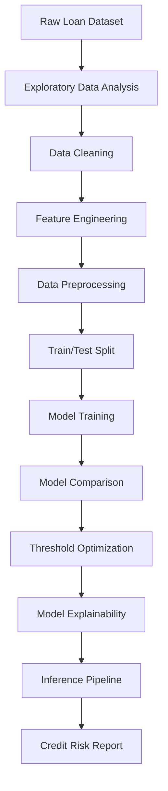
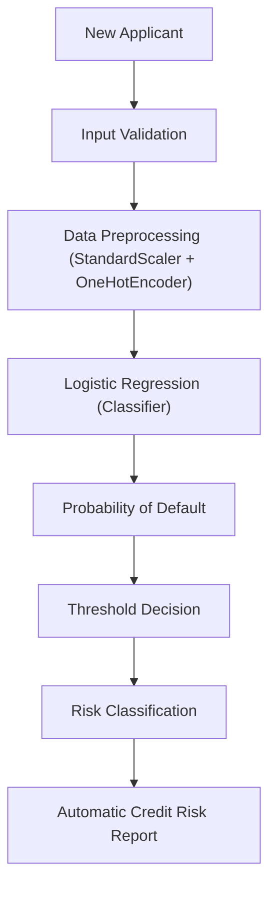
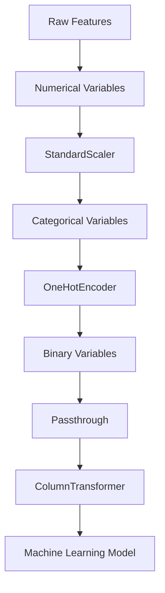
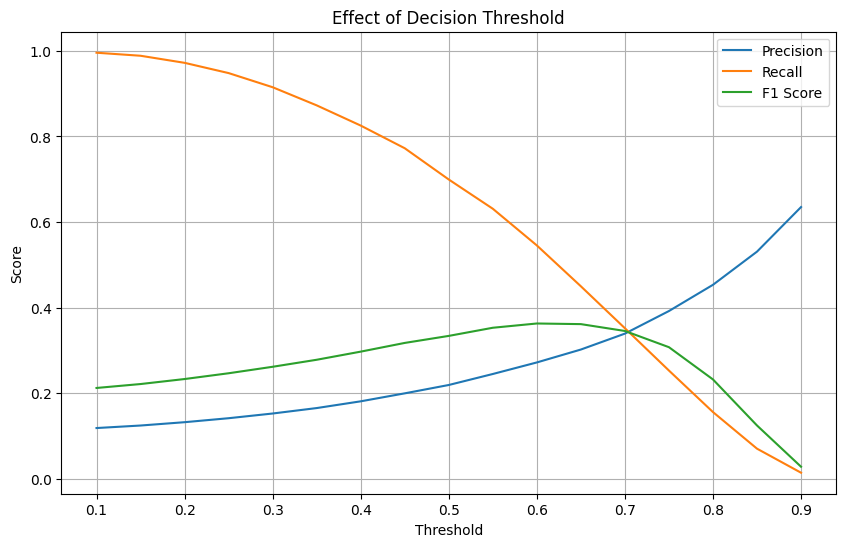

# Credit Risk Prediction Framework
An end-to-end Machine Learning solution for loan default prediction.

To access the notebooks directly and run them, click the button: 

## Project Overview
Credit risk assessment is one of the most important applications of Machine Learning in the financial industry. Financial institutions must evaluate the probability that a borrower will default on a loan before making lending decisions. An inaccurate assessment may lead to significant financial losses, while overly restrictive lending policies can reduce business opportunities.

This project presents an end-to-end Credit Risk Prediction Framework developed using supervised Machine Learning techniques. The complete workflow covers exploratory data analysis, feature engineering, data preprocessing, model development, model evaluation, threshold optimization, model interpretation and an inference pipeline capable of evaluating new loan applicants.

Several classification algorithms were compared to identify the most appropriate model according to business objectives. Instead of maximizing only overall accuracy, special attention was given to Recall, Precision, ROC-AUC and decision threshold optimization, since correctly identifying high-risk borrowers is considerably more valuable than maximizing the number of correctly classified low-risk customers.

Finally, the selected model was integrated into a prediction pipeline capable of estimating the probability of default for new applicants while automatically generating an interpretable credit risk report.

## Business Problem
Lending institutions face a fundamental challenge: approving as many profitable loans as possible while minimizing financial losses caused by borrower defaults.

Traditional credit assessment methods often rely on manual evaluations or fixed business rules, which may overlook complex relationships among applicant characteristics. As a result, financial institutions may approve high-risk applicants or reject reliable customers.

From a business perspective, the cost of these mistakes is not the same:

* **False Positives:**: Rejecting a reliable customer results in lost business opportunities and reduced revenue.
* **False Negatives:**: Approving a customer who later defaults can generate significant financial losses and increase the institution's credit risk exposure.

Therefore, the objective is not simply to maximize overall prediction accuracy. Instead, the model should prioritize identifying high-risk applicants while maintaining a reasonable balance between risk detection and business profitability.

This project addresses this challenge by developing a Machine Learning framework capable of estimating the probability of loan default before approval, providing decision support for credit analysts through interpretable predictions and risk-based recommendations.

## Project Objectives
The main objective of this project is to develop an end-to-end Machine Learning framework capable of predicting the probability that a loan applicant will default.

Specific objectives include:

* Perform Exploratory Data Analysis (EDA) to understand customer characteristics and identify potential risk patterns.
* Build a data preprocessing pipeline capable of handling numerical, categorical and binary variables.
* Compare multiple supervised Machine Learning algorithms for credit risk classification.
* Evaluate model performance using business-oriented metrics such as Precision, Recall, F1-Score and ROC-AUC.
* Optimize the decision threshold according to business requirements instead of relying solely on the default classification threshold.
* Interpret the selected model to identify the variables that most influence credit risk.
* Develop an inference pipeline capable of evaluating new applicants and automatically generating a credit risk assessment report.
* Demonstrate how Machine Learning can support credit approval decisions in financial institutions.

## Dataset

The project uses a public [**Loan Default Prediction**](https://www.kaggle.com/datasets/nikhil1e9/loan-default/data) dataset containing information about loan applicants and their repayment behavior.

### Dataset Summary

| Feature            |                 Value |
| ------------------ | --------------------: |
| Total observations |               255,347 |
| Input variables    |                    16 |
| Target variable    |               Default |
| Problem type       | Binary Classification |

The dataset includes applicant demographic information, financial indicators, employment history and loan characteristics, including:

* Applicant age
* Annual income
* Loan amount
* Credit score
* Debt-to-Income ratio (DTI)
* Employment history
* Number of credit lines
* Interest rate
* Loan purpose
* Education level
* Employment type
* Marital status
* Mortgage status
* Dependents
* Co-signer information

The target variable indicates whether the customer ultimately defaulted on the loan.

* **0** → Loan Paid
* **1** → Loan Default

## Project Workflow

The project follows an end-to-end Machine Learning workflow, starting from raw customer information and ending with an automated credit risk assessment report. Each stage was designed to simulate the lifecycle of a real-world credit risk modeling project used in financial institutions. This process is illustrated in **Diagram 1**.

  <b>Diagram 1. Project Workflow</b>

## Machine Learning Pipeline

To deploy the system to production, an automated *inference pipeline* was implemented. As illustrated in **Diagram 2** (an expansion of the inference phase in **Diagram 1**), the workflow validates the applicant's input data, applies the saved transformations, and calculates the risk for automated decision-making.

  <b>Diagram 2. Machine Learning Pipeline</b>

## Exploratory Data Analysis

The exploratory analysis focused on understanding the characteristics of loan applicants and identifying variables associated with loan default.

Several numerical and categorical variables were analyzed using descriptive statistics, distribution plots, default rate analysis, correlation analysis and business-oriented visualizations.

Some of the most relevant findings include:

* Younger applicants showed a higher probability of default.
* Lower income levels were associated with increased credit risk.
* Higher loan amounts generally produced higher default rates.
* Interest rate was one of the strongest positive risk indicators.
* Longer employment history reduced default probability.
* Customers with lower credit scores exhibited higher credit risk.
* Employment status and education level also influenced repayment behavior.

These findings guided both feature selection and the interpretation of the final predictive model.

## Data Preparation

Before training the Machine Learning models, the dataset was prepared through a structured preprocessing pipeline.

The preprocessing stage included:

* Selection of relevant numerical, categorical and binary variables.
* Standardization of numerical features using **StandardScaler**.
* One-Hot Encoding of categorical variables.
* Preservation of binary variables without additional scaling.
* Construction of a reusable **ColumnTransformer**.
* Integration of preprocessing and classification into a single Scikit-learn Pipeline.

This approach guarantees that both training data and future applicants are processed consistently, reducing the risk of data leakage and ensuring reproducible predictions. This process is illustrated in **Diagram 3**.

  <b>Diagram 3. Data Preparation</b>

## Machine Learning Models

Several supervised Machine Learning algorithms were evaluated throughout the project to identify the most appropriate solution for credit risk prediction.

The following models were implemented and compared:

| Model                          | Purpose                                      |
| ------------------------------ | -------------------------------------------- |
| Logistic Regression            | Baseline interpretable linear classifier     |
| Logistic Regression (Balanced) | Baseline model with class imbalance handling |
| K-Nearest Neighbors (KNN)      | Distance-based nonlinear classifier          |
| Decision Tree                  | Rule-based interpretable model               |
| Random Forest                  | Ensemble learning approach                   |
| Random Forest (Balanced)       | Ensemble model with class weighting          |

Rather than selecting a model based solely on prediction accuracy, each algorithm was evaluated according to its ability to identify high-risk borrowers while maintaining an acceptable trade-off between false positives and false negatives.

The analysis gave the complete picture of each modeling approach's advantages and disadvantages.

## Model Evaluation

Because the dataset is highly imbalanced, overall Accuracy was not considered an appropriate metric for model selection.

The business objective is to identify customers with a high probability of default before loan approval. Consequently, the evaluation focused primarily on:

* **Recall**, to maximize the detection of high-risk applicants.
* **Precision**, to reduce unnecessary rejection of reliable customers.
* **F1-Score**, to balance Precision and Recall.
* **ROC-AUC**, to evaluate the model's ranking capability independently of the classification threshold.

Although the baseline Logistic Regression achieved an Accuracy close to 89%, its Recall was extremely low because it predicted almost every applicant as a reliable borrower.

After incorporating class balancing, the Logistic Regression model substantially improved its ability to identify default cases while maintaining a strong ROC-AUC performance.

For this reason, the balanced Logistic Regression model was selected as the final production model.

## Threshold Optimization

Most Machine Learning classifiers use a default decision threshold of **0.50**.

However, in real-world credit risk applications, this threshold is rarely optimal because the cost of approving a customer who later defaults is significantly higher than the cost of requesting additional review for a low-risk applicant.

For this reason, multiple classification thresholds were evaluated. As illustrated in **Figure 1**, the analysis demonstrated how Precision and Recall change as the threshold varies:

* Lower thresholds maximize Recall, identifying a larger proportion of risky customers.
* Higher thresholds increase Precision but may overlook many default cases.

This analysis allows financial institutions to select a decision threshold that best matches their risk tolerance and lending strategy.

    <b>Figure 1. Effect of decision Threshold.</b>  
    

## Model Explainability

Interpretability is essential in financial applications because lending decisions must be transparent and justifiable.

After selecting the final Logistic Regression model, the model coefficients were analyzed to identify the variables that most strongly influence the probability of default.

Some of the strongest risk-increasing factors include:

* Higher interest rates
* Larger loan amounts
* Unemployment
* High School education level
* Greater number of credit lines

Conversely, the strongest risk-reducing factors include:

* Older age
* Longer employment history
* Higher annual income
* Presence of a co-signer
* Full-time employment

These findings are consistent with financial intuition and provide valuable insights for credit analysts beyond the predictive capability of the model itself.
